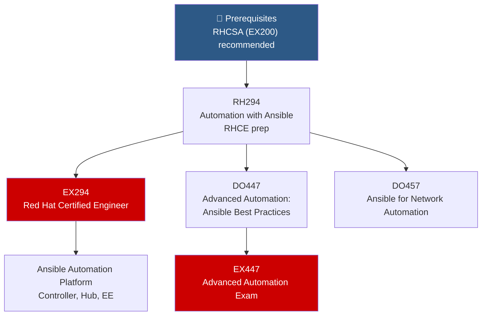

# ⚙️ Ansible Automation Path

> For automation engineers and SREs who want to automate infrastructure, configuration management, and application deployment with Red Hat Ansible Automation Platform.

---

## Path Overview

---

## Course Details

### 📗 RH294 — Red Hat System Administration III: Linux Automation with Ansible

📖 **Local course materials:** [[RH294-Ansible-Automation]]

| | |
|---|---|
| **Duration** | 5 days |
| **Prerequisites** | RHCSA (EX200) or equivalent |
| **Certification** | → [[EX294-Ansible]] |

**What you'll learn:**
- Install and configure Ansible on a control node
- Write Ansible playbooks for multi-host management
- Use variables, facts, and templates (Jinja2)
- Create and use Ansible roles
- Manage secrets with Ansible Vault
- Troubleshoot Ansible playbooks

**Key topics:** → [[Ansible-Basics]], [[Playbooks-and-Roles]]

---

### 📘 DO447 — Advanced Automation: Ansible Best Practices

📖 **Local course materials:** [[DO447-Advanced-Ansible]]

| | |
|---|---|
| **Duration** | 5 days |
| **Prerequisites** | RH294 or EX294 |
| **Certification** | → [[EX447-Advanced-Ansible]] |

**What you'll learn:**
- Implement recommended practices for effective automation
- Use advanced variable management and filters
- Develop reusable content with Ansible Content Collections
- Manage task execution with rolling updates and delegation
- Integrate Ansible with CI/CD pipelines
- Use Ansible Automation Controller (formerly Tower)

**Key topics:** → [[Ansible-Automation-Platform]], [[Execution-Environments]]

---

### 📙 DO457 — Ansible for Network Automation

📖 **Local course materials:** [[DO457-Network-Automation]]

| | |
|---|---|
| **Duration** | 5 days |
| **Prerequisites** | RH294 or equivalent Ansible skills |

**What you'll learn:**
- Automate network device configuration
- Use Ansible network modules for Cisco, Juniper, Arista
- Create network automation playbooks
- Implement backup and compliance checks

---

## Ansible for OpenShift

Once you have Ansible skills, extend into Kubernetes/OpenShift automation:

| Topic | Details | Related Notes |
|---|---|---|
| K8s module | `kubernetes.core` collection | [[Ansible-for-OpenShift]] |
| OCP module | `redhat.openshift` collection | [[Ansible-for-OpenShift]] |
| Ansible Lightspeed | AI-assisted playbook generation | [[Ansible-Lightspeed]] |
| EE | Execution Environments | [[Execution-Environments]] |

---

## Study Resources

- [Ansible Documentation](https://docs.ansible.com/)
- [Ansible Galaxy](https://galaxy.ansible.com/) — Community roles & collections
- [[EX294-Ansible]] — Core RHCE exam study guide
- [[EX447-Advanced-Ansible]] — Advanced automation exam study guide
