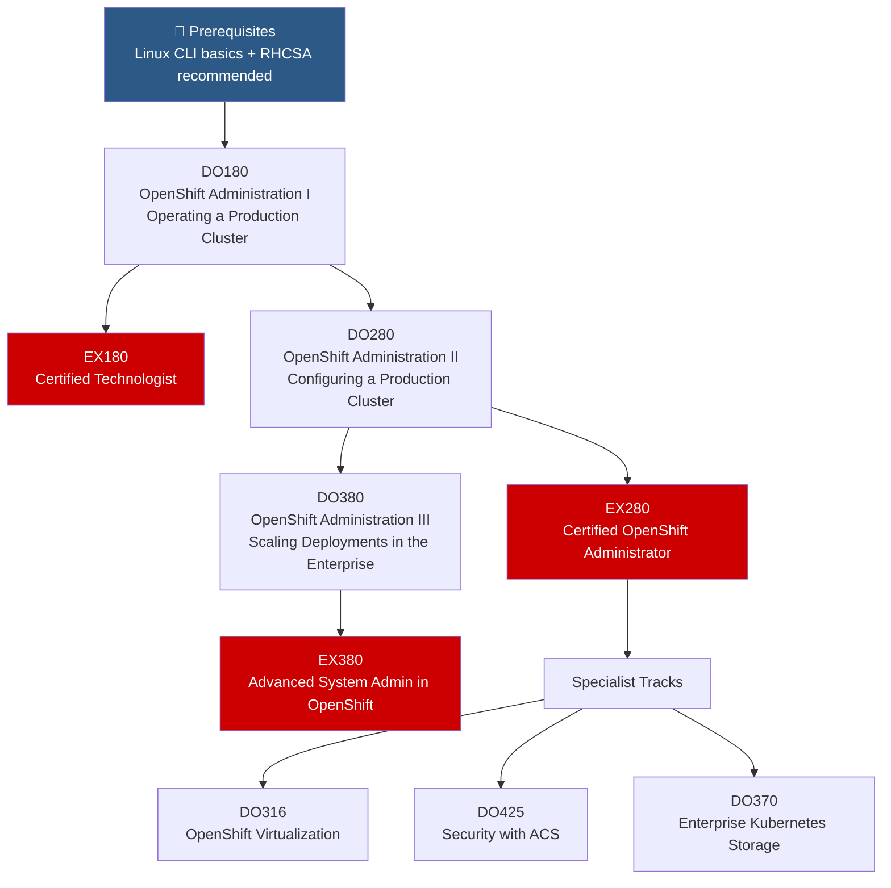

# 🏗️ OpenShift Administrator Path

> From first-time cluster user to advanced platform engineer. This is the core path for anyone managing OpenShift clusters.

---

## Path Overview

---

## Course Details

### 📗 DO180 — OpenShift Administration I: Operating a Production Cluster

📖 **Local course materials:** [[DO180-OpenShift-Administration-I]]

| | |
|---|---|
| **Duration** | 5 days |
| **Format** | Classroom, Virtual, Self-paced |
| **Prerequisites** | RH124 or equivalent Linux experience |
| **Certification** | → [[EX180-Containers-Kubernetes]] |

**What you'll learn:**
- Deploy and manage Kubernetes workloads on OpenShift
- Manage users, policies, and resource quotas
- Configure application reliability with health probes
- Manage updates for applications and the OpenShift cluster
- Work with the `oc` CLI and web console

**Key topics:** → [[Deployments-and-DeploymentConfigs]], [[RBAC]], [[Core-Concepts]]

---

### 📘 DO280 — OpenShift Administration II: Configuring a Production Cluster

📖 **Local course materials:** [[DO280-OpenShift-Administration-II]]

| | |
|---|---|
| **Duration** | 5 days |
| **Format** | Classroom, Virtual, Self-paced |
| **Prerequisites** | DO180 or equivalent experience |
| **Certification** | → [[EX280-OpenShift-Admin]] |

**What you'll learn:**
- Configure authentication and authorization (OAuth, LDAP, RBAC)
- Configure networking components (Ingress, Routes, Network Policies)
- Manage cluster node scheduling and scaling
- Configure pod scheduling and resource management
- Monitor cluster events and alerts
- Perform cluster updates

**Key topics:** → [[OAuth-and-Identity-Providers]], [[Network-Policies]], [[Ingress-and-Routes]], [[Machine-Sets-and-Machine-Config]]

---

### 📙 DO380 — OpenShift Administration III: Scaling Deployments in the Enterprise

📖 **Local course materials:** [[DO380-OpenShift-Administration-III]]

| | |
|---|---|
| **Duration** | 5 days |
| **Format** | Classroom, Virtual, Self-paced |
| **Prerequisites** | DO280 or EX280 recommended |
| **Certification** | → [[EX380-OpenShift-Advanced]] |

**What you'll learn:**
- Plan and implement OpenShift clusters at scale
- Implement GitOps workflows with OpenShift GitOps (Argo CD)
- Configure and manage cluster logging and metrics
- Automate OpenShift cluster management with Ansible
- Implement backup and restore (OADP)
- Manage multiple clusters with ACM

**Key topics:** → [[OpenShift-GitOps-ArgoCD]], [[Cluster-Logging-EFK]], [[ACM-Advanced-Cluster-Management]], [[Ansible-for-OpenShift]]

---

## Specialist Extensions

After completing the core admin path, specialize in:

| Course | Topic | Related Notes |
|---|---|---|
| DO316 | OpenShift Virtualization | [[OpenShift-Virtualization]] |
| DO425 | Security with ACS (StackRox) | [[ACS-Advanced-Cluster-Security]] |
| DO370 | Enterprise Kubernetes Storage | [[ODF-OpenShift-Data-Foundation]] |
| DO322 | OpenShift Installation on Cloud | [[IPI-vs-UPI]], [[AWS-Installation]] |

---

## Study Resources

- [Red Hat OpenShift documentation](https://docs.openshift.com/)
- [OpenShift interactive learning](https://learn.openshift.com/)
- [[EX180-Containers-Kubernetes]] — Containers and Kubernetes exam study guide
- [[EX280-OpenShift-Admin]] — OpenShift Administrator exam study guide
- [[EX380-OpenShift-Advanced]] — OpenShift Advanced Administrator exam study guide
