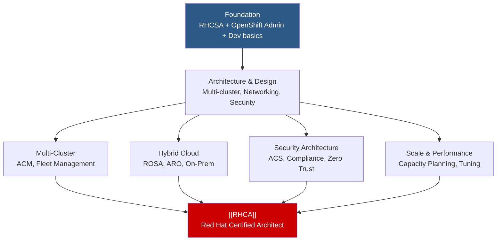

# 🏛️ OpenShift Architect Path

> For solutions architects and tech leads who design, plan, and implement OpenShift-based infrastructure. Combines admin, developer, and cross-domain knowledge.

📖 **Architectural Overview:** [[Architect-Path-Overview]]

---

## Path Overview

---

## Prerequisites

The Architect path is not a linear course sequence — it requires breadth across multiple domains:

| Foundation | Course | Status |
|---|---|---|
| Linux Administration | [[EX200-RHCSA]] | Required |
| OpenShift Administration | [[EX280-OpenShift-Admin]] | Required |
| OpenShift Development | [[EX288-OpenShift-Developer]] | Recommended |
| Ansible Automation | [[EX294-Ansible]] | Recommended |

---

## Architecture Knowledge Areas

### 1. Platform Architecture
- [[OpenShift-Architecture-Overview]] — Control plane, data plane, operators
- [[Control-Plane]] — API server, controller manager, scheduler, etcd
- [[Worker-Nodes]] — Compute topology, node types, taints/tolerations
- [[Operators-Framework]] — OLM, OperatorHub, custom operator patterns

### 2. Multi-Cluster & Fleet Management
- [[ACM-Advanced-Cluster-Management]] — Governance, observability, application lifecycle
- [[Multi-Cluster-Networking]] — Submariner, cross-cluster connectivity
- [[Fleet-Management]] — Managing hundreds of clusters

### 3. Hybrid Cloud Architecture
- [[ROSA-Red-Hat-OpenShift-on-AWS]] — AWS-native managed OpenShift
- [[ARO-Azure-Red-Hat-OpenShift]] — Azure-native managed OpenShift
- [[Hybrid-Cloud-Strategy]] — Consistency across clouds and on-prem
- [[OpenShift-Dedicated]] — Fully managed clusters

### 4. Security Architecture
- [[ACS-Advanced-Cluster-Security]] — StackRox / RHACS
- [[SCC-Security-Context-Constraints]] — Pod security policies
- [[Supply-Chain-Security]] — Image signing, SBOM, Sigstore
- [[Compliance-Operator]] — Automated compliance scanning

### 5. Networking Architecture
- [[SDN-Overview]] — Network architecture decisions
- [[OVN-Kubernetes]] — Default CNI deep-dive
- [[Service-Mesh]] — Istio service mesh architecture
- [[Network-Policies]] — Microsegmentation strategies

### 6. Storage Architecture
- [[ODF-OpenShift-Data-Foundation]] — Software-defined storage
- [[Persistent-Volumes]] — Storage classes, dynamic provisioning
- [[CSI-Drivers]] — Vendor-specific storage integration

### 7. Scaling & Performance
- [[Performance-Tuning]] — Resource management, node tuning operator
- [[Cluster-Autoscaler]] — Automatic cluster scaling
- [[Machine-Sets-and-Machine-Config]] — Infrastructure management

---

## Relevant Courses

| Course | Topic | Focus |
|---|---|---|
| [[DO280-OpenShift-Administration-II]] | OCP Admin II | Cluster configuration |
| [[DO380-OpenShift-Administration-III]] | OCP Admin III | Enterprise scaling |
| DO370 | Enterprise K8s Storage | ODF deep-dive |
| DO322 | OCP Installation | Multi-env installation |
| DO425 | Security with ACS | Security architecture |
| DO316 | OpenShift Virtualization | VM workloads on K8s |

---

## [[RHCA]] — Red Hat Certified Architect

The **Red Hat Certified Architect** requires:
1. Active RHCE ([[EX294-Ansible]]) certification
2. Pass **5 additional** Red Hat concentration exams from a qualifying list

Common architect-track exams:
- [[EX280-OpenShift-Admin]] — OpenShift Administrator
- [[EX380-OpenShift-Advanced]] — Advanced OpenShift Administrator
- [[EX288-OpenShift-Developer]] — OpenShift Application Developer
- [[EX447-Advanced-Ansible]] — Advanced Automation: Ansible Best Practices
- [[EX180-Containers-Kubernetes]] — Containers and Kubernetes

---

## Architecture Decision Records

> [!TIP]
> As you learn, create ADR (Architecture Decision Record) notes in this vault to document your design decisions and trade-offs.
