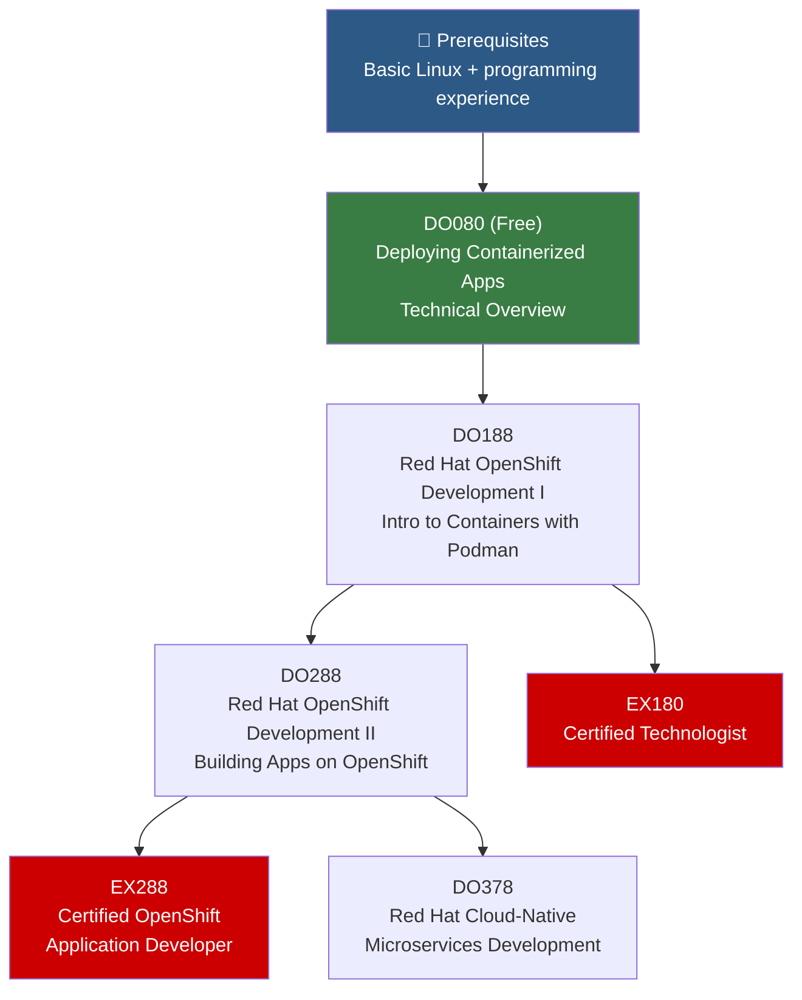

# 💻 OpenShift Developer Path

> For application developers who build and deploy apps on OpenShift/Kubernetes. Focus on containerizing, deploying, and managing cloud-native applications.

---

## Path Overview

---

## Course Details

### 🆓 DO080 — Deploying Containerized Applications Technical Overview (Free)

📖 **Local course materials:** [[DO080-Containerized-Applications-Overview]]

| | |
|---|---|
| **Duration** | ~3 hours |
| **Format** | Self-paced video |
| **Prerequisites** | None |
| **Cost** | Free |

**What you'll learn:**
- Container architecture and terminology
- Benefits of containerized applications
- Overview of container orchestration with Kubernetes and OpenShift

---

### 📗 DO188 — Red Hat OpenShift Development I: Introduction to Containers with Podman

📖 **Local course materials:** [[DO188-OpenShift-Development-I]]

| | |
|---|---|
| **Duration** | 5 days |
| **Format** | Classroom, Virtual, Self-paced |
| **Prerequisites** | Programming experience in any language |
| **Certification** | → [[EX180-Containers-Kubernetes]] |

**What you'll learn:**
- Build and manage containers with Podman
- Create custom container images with Containerfiles
- Manage multi-container applications with Podman and Pods
- Deploy containerized applications on OpenShift
- Troubleshoot containerized applications

**Key topics:** → [[Podman-and-Containers]], [[Core-Concepts]], [[Pods-and-Containers]]

---

### 📘 DO288 — Red Hat OpenShift Development II: Building Kubernetes Applications

📖 **Local course materials:** [[DO288-OpenShift-Development-II]]

| | |
|---|---|
| **Duration** | 5 days |
| **Format** | Classroom, Virtual, Self-paced |
| **Prerequisites** | DO188 or equivalent |
| **Certification** | → [[EX288-OpenShift-Developer]] |

**What you'll learn:**
- Design containerized applications for OpenShift
- Customize source-to-image (S2I) builder images
- Create and deploy applications using OpenShift templates and Helm
- Implement health checks and manage application updates
- Integrate external services and manage application configurations
- Implement CI/CD with OpenShift Pipelines (Tekton)

**Key topics:** → [[Source-to-Image-S2I]], [[Helm]], [[OpenShift-Pipelines-Tekton]], [[Image-Streams]]

---

### 💡 DO378 — Red Hat Cloud-Native Microservices Development with Quarkus

📖 **Local course materials:** [[DO378-Cloud-Native-Microservices]]

| | |
|---|---|
| **Duration** | 5 days |
| **Format** | Classroom, Virtual, Self-paced |
| **Prerequisites** | DO288 or Java development experience |

**What you'll learn:**
- Develop microservices with Quarkus
- Implement reactive systems
- Build serverless functions with Knative
- Implement distributed tracing and monitoring
- Use Kafka for event-driven architectures

**Key topics:** → [[Quarkus]], [[Serverless-Knative]], [[AMQ-Streams-Kafka]], [[Cluster-Monitoring]]

---

## Study Resources

- [Quarkus Guides](https://quarkus.io/guides/)
- [OpenShift Developer Documentation](https://docs.openshift.com/container-platform/latest/applications/index.html)
- [[EX288-OpenShift-Developer]] — Exam study guide
- [[Hands-On-Labs]] — Interactive labs
