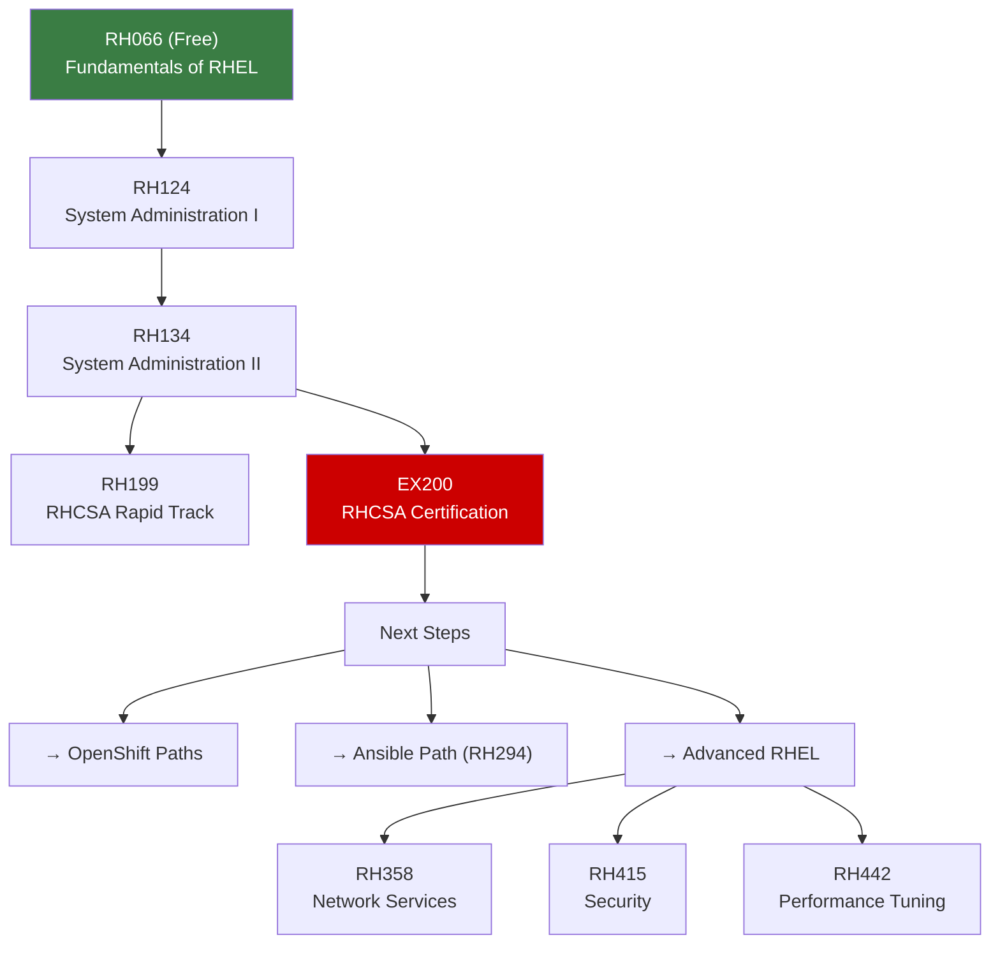

# 🐧 RHEL System Administration Path

> The foundational path for all Red Hat careers. RHCSA (EX200) is the prerequisite recommended for all other Red Hat learning paths.

---

## Path Overview

---

## Course Details

### 🆓 RH066 — Fundamentals of Red Hat Enterprise Linux (Free)

| | |
|---|---|
| **Duration** | ~10 hours |
| **Format** | Self-paced online |
| **Prerequisites** | None |
| **Cost** | Free |

---

### 📗 RH124 — Red Hat System Administration I

| | |
|---|---|
| **Duration** | 5 days |
| **Prerequisites** | Basic computing skills |

**What you'll learn:**
- Command line essentials (bash, file management)
- Users, groups, and permissions
- File systems and partitioning
- Package management with DNF
- Basic networking configuration
- Service management with systemd

**Key topics:** → [[System-Administration]], [[Package-Management-DNF-RPM]], [[Systemd]]

---

### 📘 RH134 — Red Hat System Administration II

| | |
|---|---|
| **Duration** | 5 days |
| **Prerequisites** | RH124 or equivalent |

**What you'll learn:**
- Shell scripting and automation
- Storage management (LVM, Stratis, VDO)
- Network configuration and troubleshooting
- Firewall management (firewalld)
- SELinux administration
- Container basics with Podman
- Scheduled tasks (cron, at)

**Key topics:** → [[Storage-LVM-Stratis]], [[SELinux]], [[Firewall-and-Security]], [[Podman-and-Containers]]

---

### 📙 RH199 — RHCSA Rapid Track

| | |
|---|---|
| **Duration** | 5 days (accelerated RH124 + RH134) |
| **Prerequisites** | Significant Linux experience |
| **Certification** | → EX200 |

Combined course for experienced Linux users who want to fast-track to RHCSA.

---

## EX200 — RHCSA Certification

The **Red Hat Certified System Administrator** exam covers:
- Essential file management and text editing
- Managing users, groups, and permissions
- Configuring networking and firewall
- Managing storage with LVM
- Configuring and troubleshooting services (systemd)
- Managing SELinux settings
- Automating with simple shell scripts
- Managing containers with Podman

See [[EX200-RHCSA]] for detailed study guide.

---

## Advanced RHEL Courses

| Course | Topic | Related Notes |
|---|---|---|
| RH358 | Network Services (DNS, DHCP, etc.) | [[Networking-Linux]] |
| RH415 | Security: Linux in Physical, Virtual, and Cloud | [[SELinux]], [[Firewall-and-Security]] |
| RH442 | Performance Tuning | [[System-Administration]] |

---

## Study Resources

- [RHEL Documentation](https://access.redhat.com/documentation/en-us/red_hat_enterprise_linux/)
- [RHEL Interactive Labs](https://lab.redhat.com/)
- [[EX200-RHCSA]] — Exam study guide
