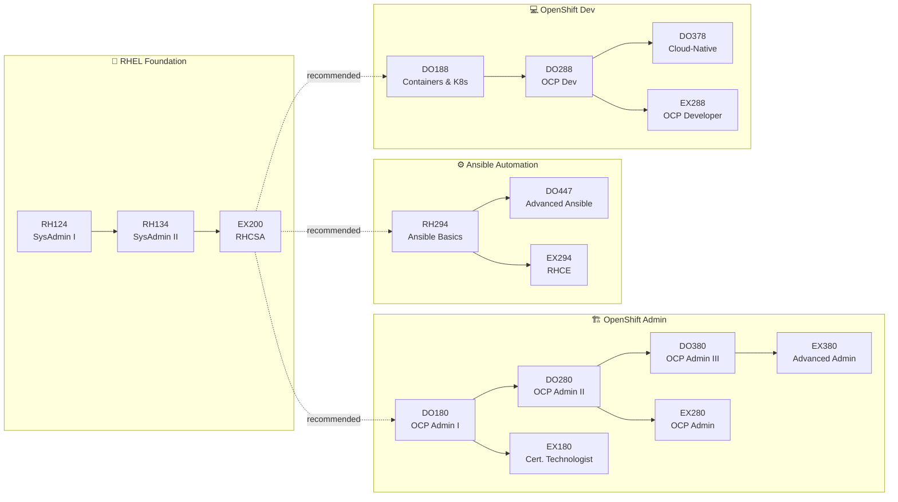

# 📚 Learning Paths

> Structured skill paths based on [Red Hat's official OpenShift training curriculum](https://www.redhat.com/en/resources/openshift-skill-paths-datasheet). Each path progresses from foundational to advanced, with clear course → certification mapping.

---

## Path Overview

---

## Available Paths

| Path | Target Role | Key Courses | Certifications |
|---|---|---|---|
| [[OpenShift-Administrator-Path]] | Cluster Admin / Platform Engineer | DO180, DO280, DO380 | EX180, EX280, EX380 |
| [[OpenShift-Developer-Path]] | App Developer / DevOps Engineer | DO188, DO288, DO378 | EX180, EX288 |
| [[OpenShift-Architect-Path]] | Solutions Architect / Tech Lead | Cross-domain | RHCA |
| [[Ansible-Automation-Path]] | Automation Engineer / SRE | RH294, DO447, DO457 | EX294, EX447 |
| [[RHEL-SysAdmin-Path]] | Linux SysAdmin / Foundation | RH124, RH134, RH199 | EX200 |

---

## Recommended Progression

> [!TIP]
> **Start with RHEL** if you're new to Linux. The RHCSA (EX200) is the foundation for all other paths.

1. **Foundation** → [[RHEL-SysAdmin-Path]] → get RHCSA
2. **Choose your role** →
   - Platform Engineer? → [[OpenShift-Administrator-Path]]
   - Developer? → [[OpenShift-Developer-Path]]
   - Full-stack automation? → [[Ansible-Automation-Path]]
3. **Specialize** → [[OpenShift-Architect-Path]] or domain-specific courses

---

## Free Starting Points

| Resource | Description |
|---|---|
| [DO080](https://www.redhat.com/en/services/training/do080-deploying-containerized-applications-technical-overview) | Deploying Containerized Applications (free) |
| [DO101](https://www.redhat.com/en/services/training/do101-introduction-openshift-applications) | Introduction to OpenShift Applications (free) |
| [RH066](https://www.redhat.com/en/services/training/rh066-fundamentals-red-hat-enterprise-linux) | Fundamentals of RHEL (free) |
| [Interactive Learning Portal](https://learn.openshift.com/) | Browser-based OpenShift labs |
