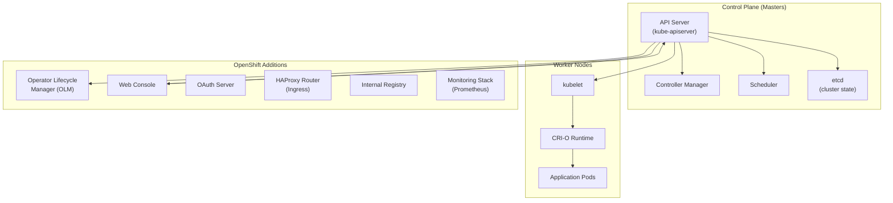

# OpenShift Architecture Overview

> Red Hat OpenShift Container Platform (OCP) is an enterprise Kubernetes platform that adds developer and operational tools on top of upstream Kubernetes.

---

## High-Level Architecture

---

## Key Differences: OpenShift vs Vanilla Kubernetes

| Feature | Kubernetes | OpenShift |
|---|---|---|
| **Container Runtime** | Configurable | CRI-O (mandatory) |
| **Networking** | CNI plugins | OVN-Kubernetes (default) |
| **Ingress** | Ingress resource | Routes + Ingress |
| **Security** | PodSecurityPolicy/Standards | SCC (Security Context Constraints) |
| **Image Registry** | Not included | Integrated registry |
| **CI/CD** | Not included | Pipelines (Tekton), GitOps (Argo CD) |
| **Web Console** | Dashboard (basic) | Full-featured web console |
| **Authentication** | Basic, OIDC | OAuth server with multiple providers |
| **Node OS** | Any Linux | RHCOS (immutable, managed) |
| **Updates** | Manual | OTA via ClusterVersion operator |

---

## Core Components

### Control Plane
- [[Control-Plane]] — Deep dive into control plane components
- [[etcd]] — The cluster state store

### Node Management
- [[Worker-Nodes]] — Worker node architecture
- [[Machine-Sets-and-Machine-Config]] — Declarative node management
- Red Hat CoreOS (RHCOS) — Immutable, container-optimized OS

### Operators
- [[Operators-Framework]] — The operator pattern is central to OpenShift
- Every OpenShift component is managed by an operator (ClusterOperators)

---

## Further Reading

- [OpenShift Architecture Docs](https://docs.openshift.com/container-platform/latest/architecture/architecture.html)
- [[OpenShift-Administrator-Path]] — Learning path for administrators
