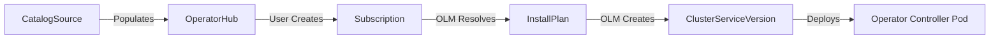

# Operators Framework

> [!NOTE]
> Operators are the standard management pattern in OpenShift. An Operator is a custom controller that uses Custom Resource Definitions (CRDs) to package, deploy, and manage a Kubernetes application. By extending the Kubernetes API, it automates operational tasks such as backups, upgrades, and scaling without manual intervention.

---

## The Operator Maturity Model

Operators are categorized into five levels of capability, showing the depth of operational knowledge encoded into the software:

```
Level 1: Basic Install   ===> Level 2: Seamless Upgrades ===> Level 3: Full Lifecycle ===> Level 4: Deep Insights ===> Level 5: Auto Pilot
(Automated deployment)        (Patch & minor version updates)  (Backup/Restore/Recovery)    (Metrics & Alerts)         (Self-healing & Scaling)
```

1. **Level 1: Basic Install**: Automates provisioning and initial configuration of the application.
2. **Level 2: Seamless Upgrades**: Handles version migrations, patch updates, and data schema migrations automatically.
3. **Level 3: Full Lifecycle**: Manages application state backup, disaster recovery, restore procedures, and storage recycling.
4. **Level 4: Deep Insights**: Exposes Prometheus metrics, log analytics, alerts, and tracing for the application.
5. **Level 5: Auto Pilot**: Performs automatic horizontal/vertical scaling, self-healing on failure, and automatic configuration tuning based on load.

---

## Operator Lifecycle Manager (OLM)

OLM manages the install-time and runtime operations of Operators. It models Operators as services, ensuring dependencies are resolved and the version updates occur safely.

### Key OLM Resource Types:
* **CatalogSource**: A repository of metadata (CSV, CRDs) representing available Operators. It populates OperatorHub.
* **Subscription**: Establishes intent to install an Operator and tracks a specific upgrade channel (e.g., `stable-v2`).
* **InstallPlan**: Generated by OLM to describe the exact resources (ClusterRoles, Deployments, CRDs) that will be created to install the Operator.
* **ClusterServiceVersion (CSV)**: The core manifest representing the Operator. It contains version details, dependency requirements, and references to the Operator deployment container.



---

## Walkthrough: Building a Custom Helm-Based Operator

The Operator SDK allows developers to easily bootstrap custom Operators using Go, Ansible, or Helm. Below is a step-by-step walkthrough to build a custom Operator wrapping a Helm Chart.

### 1. Initialize the Project
Ensure you have the `operator-sdk` CLI installed, then initialize a project:
```bash
operator-sdk init --domain my.domain --plugins helm
```

### 2. Create the API & Custom Resource (CR)
Generate the API definition and link it to an existing Helm chart (e.g., Nginx):
```bash
operator-sdk create api \
    --group apps \
    --version v1alpha1 \
    --kind WebApp \
    --helm-chart=stable/nginx-ingress
```
This generates:
- A CRD file: `config/crd/bases/apps.my.domain_webapps.yaml`
- A sample Custom Resource: `config/samples/apps_v1alpha1_webapp.yaml`
- Helm values configuration inside `helm-charts/nginx-ingress/`

### 3. Review the Custom Resource Manifest
The custom resource acts as the user interface to your Operator. Users edit this YAML to configure their application:

```yaml
apiVersion: apps.my.domain/v1alpha1
kind: WebApp
metadata:
  name: prod-webapp
  namespace: my-web-apps
spec:
  # These values map directly to Helm values
  replicaCount: 3
  service:
    port: 80
```

### 4. Build and Push the Operator Container Image
Compile the operator manager wrapper and push it to a registry (e.g., Quay):
```bash
# Build image
make docker-build IMG=quay.io/myorg/webapp-operator:v0.1.0

# Push image
make docker-push IMG=quay.io/myorg/webapp-operator:v0.1.0
```

### 5. Deploy the Operator to the Cluster
Use the generated Kustomize manifests to deploy the Operator instance:
```bash
make deploy IMG=quay.io/myorg/webapp-operator:v0.1.0
```

---

## Related Notes
- [[OpenShift-Architecture-Overview]]
- [[CRDs-and-Operators]]
- [[Ansible-for-OpenShift]]
