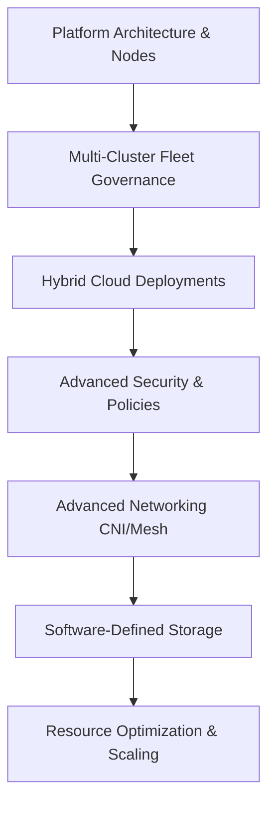

# 🏛️ OpenShift Architect Path: Cross-Domain Design Overview

> The comprehensive guide for solutions architects and tech leads designing, planning, and implementing OpenShift-based infrastructure across hybrid cloud architectures.

---

## Path Overview

---

## 1. Platform Architecture & Node Topologies

### Control Plane Layout
The OpenShift Control Plane consists of three dedicated physical or virtual nodes. It runs the key Kubernetes APIs and the etcd cluster.

- **etcd Placement:** etcd is highly sensitive to disk write latency. It requires high-speed SSDs/NVMe storage to prevent leader election failures.
- **OLM & Operators:** Operators manage platform state. Custom operators should separate their controllers from the default namespaces to avoid scheduling resource exhaustion.

### Compute Nodes (Worker Topologies)
Worker nodes can be grouped using **MachineSets**:
- **Application Nodes:** Default pool for running developer container workloads.
- **Infrastructure Nodes:** Dedicated pool carrying taints to isolate system routers (Ingress), image registries, monitoring stacks, and logging collectors (exempts these pods from worker license fees).
- **Edge Nodes:** Minimal footprint installations located close to data sources (e.g. Single Node OpenShift - SNO).

---

## 2. Hybrid Cloud Deployments (Managed vs Self-Managed)

Architects must decide between fully managed cloud offerings and self-managed installations:

| Deployment | Managed By | Cloud Integration | Use Case |
|---|---|---|---|
| **ROSA** (Red Hat OpenShift on AWS) | Red Hat & AWS | Direct AWS API access, IAM credential mappings | AWS-centric cloud migrations |
| **ARO** (Azure Red Hat OpenShift) | Red Hat & Microsoft | ExpressRoute, Azure Active Directory integrations | Azure enterprise deployments |
| **Self-Managed** (Bare-Metal / VMware) | Customer | Manual hardware integration, CSI storage drivers | Strict data sovereignty/on-prem |

---

## 3. Advanced Security (Zero Trust & ACS)

### Security Context Constraints (SCC)
OpenShift enforces strict pod isolation via SCCs. Applications should never request the `privileged` SCC unless they require direct access to host kernels. Secure profiles use `restricted-v2` by default.

### Advanced Cluster Security (ACS / StackRox)
ACS provides zero-trust security mapping across three stages:
- **Build:** Scanning image layers for CVEs inside S2I pipelines.
- **Deploy:** Enforcing admission controllers (e.g., blocking pods running as root or with host mounts).
- **Runtime:** Monitoring system calls (e.g., detecting unauthorized shells in running containers).

---

## 4. Advanced Networking: OVN-Kubernetes & Service Mesh

### OVN-Kubernetes CNI
RHEL OpenShift uses **OVN-Kubernetes (OVN-K)** as its default Software-Defined Network CNI:
- **Egress IPs:** Assigns static IP addresses to egress traffic leaving the cluster from specific namespaces (essential for external firewall whitelisting).
- **NetworkPolicies:** Evaluates packet headers directly in Open vSwitch (OVS) kernels for microsegmentation.

### Service Mesh (Istio-based)
Provides Layer 7 traffic management:
- **Mutual TLS (mTLS):** Automatically encrypts pod-to-pod communications.
- **Traffic Splitting:** Canary deployments (e.g. routing 10% of traffic to v2).
- **Observability:** Distributed tracing (Jaeger/Tempo) and visual topology dashboards (Kiali).

---

## 5. Enterprise Storage & Scaling

### OpenShift Data Foundation (ODF)
ODF is a Ceph-based software-defined storage platform integrated into the OpenShift console. It provides:
- **File Storage (ReadWriteMany - RWX):** Shared storage classes for multi-pod access (e.g., WordPress uploads).
- **Block Storage (ReadWriteOnce - RWO):** High-speed storage for databases.
- **Object Storage (S3-compatible):** Scale-out file dumping.

### Scaling Strategies
- **Horizontal Pod Autoscaler (HPA):** Scales pod count based on CPU/Memory usage or custom Prometheus metrics.
- **Vertical Pod Autoscaler (VPA):** Automatically adjusts container CPU/Memory request parameters based on usage histories.
- **Cluster Autoscaler:** Automatically provisions new cloud worker nodes via MachineSets when pods are pending due to lack of resource capacity.

---

## Related Notes
- [[OpenShift-Architecture-Overview]] — Platform basics
- [[ACM-Advanced-Cluster-Management]] — Fleet management MOC
- [[ACS-Advanced-Cluster-Security]] — Security details
- [[RHCA]] — Certification guide
- [[OpenShift-Architect-Path]] — MOC
