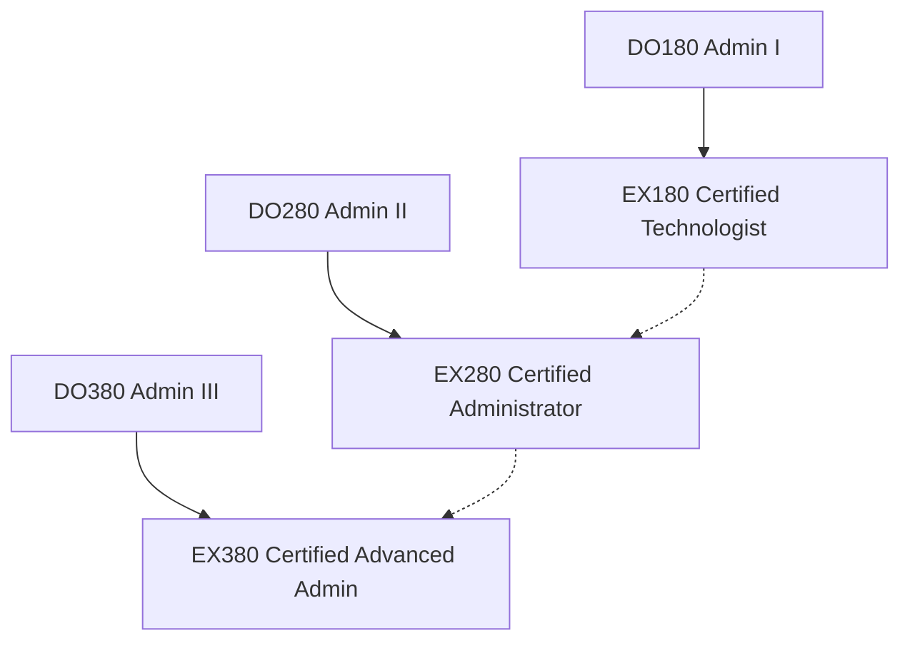

# 📖 OpenShift Administrator Courses

> Course materials for the OpenShift Administrator learning path. Each note contains detailed configurations, workflows, real-world CLI examples, and verification steps.

---

## Core Curriculum

| Course | Title | Duration | Certification |
|---|---|---|---|
| [[DO180-OpenShift-Administration-I]] | Operating a Production Cluster | 5 days | → [[EX180-Containers-Kubernetes]] |
| [[DO280-OpenShift-Administration-II]] | Configuring a Production Cluster | 5 days | → [[EX280-OpenShift-Admin]] |
| [[DO380-OpenShift-Administration-III]] | Scaling Deployments in the Enterprise | 5 days | → [[EX380-OpenShift-Advanced]] |

---

## Study Track & Certifications

The OpenShift Administrator curriculum is structured to prepare platform engineers for three tiers of certification:

- [[EX180-Containers-Kubernetes]] — Containers, basic Podman usage, and simple Kubernetes workloads.
- [[EX280-OpenShift-Admin]] — OAuth, identity management, local routing, RBAC, scheduling, and NetworkPolicies.
- [[EX380-OpenShift-Advanced]] — Argo CD GitOps, central logging, Prometheus metric scrapes, upgrades, and ACM.

---

## Learning Path

→ [[OpenShift-Administrator-Path]] — Full platform engineer MOC
