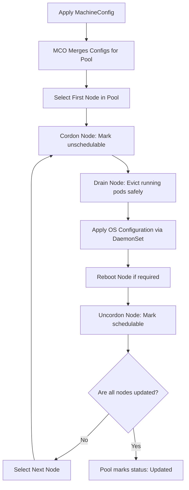

# Machine Sets and Machine Config

> [!NOTE]
> OpenShift manages its nodes declaratively using the **Machine API** and the **Machine Config Operator (MCO)**. This allows administrators to manage underlying infrastructure (VM provisioning) and operating system configuration (Red Hat Enterprise Linux CoreOS - RHCOS) directly from Kubernetes resources.

---

## Machine API & MachineSets

The Machine API operates similarly to standard Kubernetes Pod controllers but applies to VM resources:
* **Machine**: Represents a single node (physical or cloud VM).
* **MachineSet**: Manages a group of Machines (like a ReplicaSet). If a node fails or is deleted, the MachineSet controller automatically provisions a new VM in the target cloud or hypervisor environment and registers it as a node.

### MachineSet YAML Example (AWS Infrastructure Provider)
This manifest provisions an AWS ec2 instance of type `m5.large` and registers it as a worker node:

```yaml
apiVersion: machine.openshift.io/v1beta1
kind: MachineSet
metadata:
  name: cluster-1234-worker-us-east-1a
  namespace: openshift-machine-api
spec:
  replicas: 2
  selector:
    matchLabels:
      machine.openshift.io/cluster-api-machineset: cluster-1234-worker-us-east-1a
  template:
    metadata:
      labels:
        machine.openshift.io/cluster-api-machineset: cluster-1234-worker-us-east-1a
    spec:
      providerSpec:
        value:
          apiVersion: awsproviderspec.openshift.io/v1beta1
          kind: AWSMachineProviderConfig
          instanceType: m5.large
          ami:
            id: ami-0d12ab345ef6789a0 # CoreOS AMI reference
          credentialsSecret:
            name: aws-cloud-credentials
          placement:
            region: us-east-1
            availabilityZone: us-east-1a
          securityGroups:
            - filters:
                - name: tag:Name
                  values:
                    - cluster-1234-worker-sg
```

---

## MachineConfig & The Machine Config Operator (MCO)

The **Machine Config Operator (MCO)** acts as the "cluster-level sysadmin". It ensures that RHEL CoreOS nodes have the correct files, systemd configurations, registry authorizations, and kernel parameters.

* **Ignition Config**: RHCOS uses Ignition during first-boot to configure disk partitioning, write files, and start systemd units.
* **MachineConfigPool (MCP)**: Groups nodes by role (e.g., `master`, `worker`). MCO generates a merged config for the pool and applies it sequentially across nodes in the pool.

### MachineConfig YAML Example (Writing a Custom File & Setting Kernel Arguments)
The following configuration writes a custom NTP config to `/etc/chrony.conf` on all worker nodes:

```yaml
apiVersion: machineconfiguration.openshift.io/v1
kind: MachineConfig
metadata:
  labels:
    machineconfiguration.openshift.io/role: worker # Apply to all nodes in the worker pool
  name: 99-worker-chrony-configuration
spec:
  config:
    ignition:
      version: 3.2.0
    storage:
      files:
        - contents:
            source: data:,server%20time.nist.gov%20iburst
          mode: 420 # Octal 0644 equivalent
          overwrite: true
          path: /etc/chrony.conf
  kernelArguments:
    - nosmt # Disable hyper-threading for specific security/performance workloads
```

---

## The MachineConfig Update Lifecycle Flow

When a new `MachineConfig` is applied, the MCO performs a rolling update to prevent cluster disruption:



To monitor the pool updating status:
```bash
oc get machineconfigpools
```
*Look for `UPDATING` (True) and `DEGRADED` (False) flags during configuration rolls.*

---

## Related Notes
- [[Worker-Nodes]]
- [[Cluster-Autoscaler]]
- [[Performance-Tuning]]
