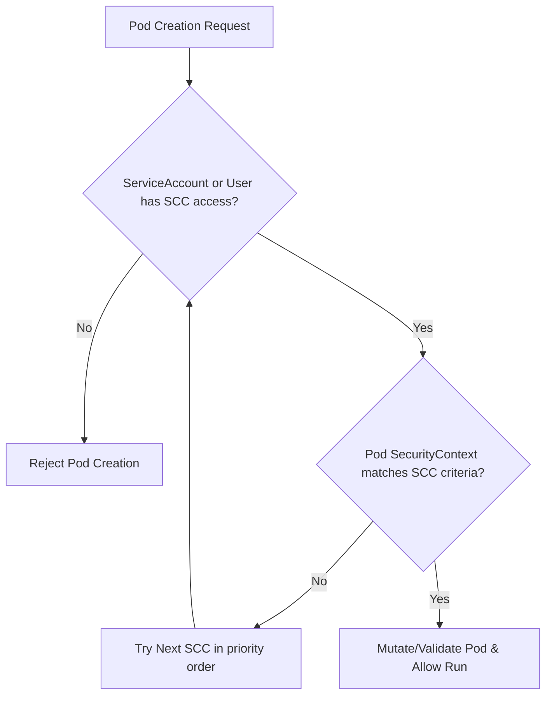

# SCC — Security Context Constraints

> [!NOTE]
> Security Context Constraints (SCCs) are OpenShift-native resources that govern pod permissions. They function similarly to Kubernetes Pod Security Admissions (PSA) but provide much more granular, system-level control over what a pod can do on the node.

---

## The SCC Admission Process

When a pod is created, OpenShift inspects its security context details and compares them against the SCCs available to the user and the pod's ServiceAccount. 



### SCC Priority & Selection
OpenShift evaluates SCCs in a specific order:
1. **Priority Score**: SCCs with higher priority (defined in `priority` field) are evaluated first.
2. **Most Restrictive**: If priorities are equal, SCCs are sorted from most restrictive to least restrictive.
3. **First Match**: The first SCC that matches the Pod's security context requirements is assigned.

---

## Default SCCs (Ordered Most to Least Restrictive)

| SCC Name | Description | Key Capabilities / Settings |
|---|---|---|
| `restricted-v2` | Default for user workloads in OpenShift 4.12+. Fully aligned with K8s Restricted Pod Security Standard. | Denies root, limits volume types, allocates random UID/GID. |
| `restricted` | Legacy default user workload SCC. | Similar to `restricted-v2` but allows more default volumes (like hostPath read-only in some older versions). |
| `nonroot` | Allows pods to run with any non-root UID. | Retains other restrictions of `restricted`. |
| `nonroot-v2` | Aligned with K8s Restricted profile but allows any non-root UID. | Modern version of `nonroot`. |
| `anyuid` | Allows pods to run with any UID, including root (UID 0). | Used for legacy container images that require root access. |
| `hostaccess` | Allows host networking and host ports. | Combines `anyuid` with host network access. |
| `hostnetwork` | Allows host networking but keeps other privileges restricted. | Used for system services needing node IP exposure. |
| `privileged` | Unrestricted access to the host. | Equivalent to root access on the underlying node. Use with extreme caution. |

---

## Checking and Inspecting SCCs

Use the OpenShift CLI (`oc`) to manage and inspect SCC configurations.

### List all SCCs in the cluster
```bash
oc get scc
```

### Describe a specific SCC
```bash
oc describe scc restricted-v2
```

### Check which SCC a Pod is using
Look at the pod annotations for `openshift.io/scc`:
```bash
oc get pod <pod_name> -n <namespace> -o jsonpath='{.metadata.annotations.openshift\.io/scc}'
```

---

## Custom SCC Example

In production, you should avoid using `privileged` or `anyuid` if a container only needs a single specific privilege (such as changing network routes or binding to privileged ports). Instead, create a custom SCC.

### 1. Define the Custom SCC (`custom-net-admin-scc.yaml`)
This custom SCC allows containers to run with the `NET_ADMIN` capability while maintaining standard security constraints:

```yaml
apiVersion: security.openshift.io/v1
kind: SecurityContextConstraints
metadata:
  name: custom-net-admin-scc
settings:
  priority: null
allowPrivilegedContainer: false
allowPrivilegeEscalation: false
allowedCapabilities:
- NET_ADMIN
defaultAddCapabilities: []
requiredDropCapabilities:
- KILL
- MKNOD
- SETUID
- SETGID
runAsUser:
  type: MustRunAsRange
seLinuxContext:
  type: MustRunAs
fsGroup:
  type: MustRunAs
supplementalGroups:
  type: MustRunAs
volumes:
- configMap
- downwardAPI
- emptyDir
- persistentVolumeClaim
- secret
```

Apply it to the cluster:
```bash
oc apply -f custom-net-admin-scc.yaml
```

### 2. Grant Access to the Custom SCC
To allow a specific ServiceAccount in a namespace to use this SCC, you can associate it via RBAC:

```yaml
apiVersion: rbac.authorization.k8s.io/v1
kind: RoleBinding
metadata:
  name: system:openshift:scc:custom-net-admin
  namespace: my-app-prod
subjects:
- kind: ServiceAccount
  name: net-manager-sa
  namespace: my-app-prod
roleRef:
  apiGroup: rbac.authorization.k8s.io
  kind: ClusterRole
  name: system:openshift:scc:custom-net-admin-scc
```

*Note: In OpenShift, you can also use `oc adm` to bind SCCs directly:*
```bash
oc adm policy add-scc-to-user custom-net-admin-scc -z net-manager-sa -n my-app-prod
```

---

## SCC Troubleshooting Guide

### Issue: Pod fails to start or goes into `CreateContainerConfigError`
If a pod deployment fails, check the namespace events:
```bash
oc get events --sort-by='.metadata.creationTimestamp'
```
Look for events matching: `unable to validate against any security context constraint`.

#### Root Causes & Resolutions:
1. **Root User Restriction**: The container image tries to run as `root` (UID 0), but the default `restricted-v2` SCC blocks it.
   - *Fix*: Modify the container image to run as a non-root user (best practice), or grant the `anyuid` SCC to the ServiceAccount if root is absolutely required.
2. **Unsupported Volumes**: The pod requests a `hostPath` volume, which is blocked by default.
   - *Fix*: Use standard `persistentVolumeClaims` instead of `hostPath`, or grant a higher-privilege SCC (like `hostaccess` or `privileged`) if it is a cluster administrative pod.
3. **Capabilities Blocked**: The pod specification includes a custom capability (e.g., `SYS_TIME`).
   - *Fix*: Create a custom SCC allowing `SYS_TIME` and bind it to the pod's ServiceAccount.

---

## Related Notes
- [[RBAC]]
- [[OAuth-and-Identity-Providers]]
- [[Worker-Nodes]]
