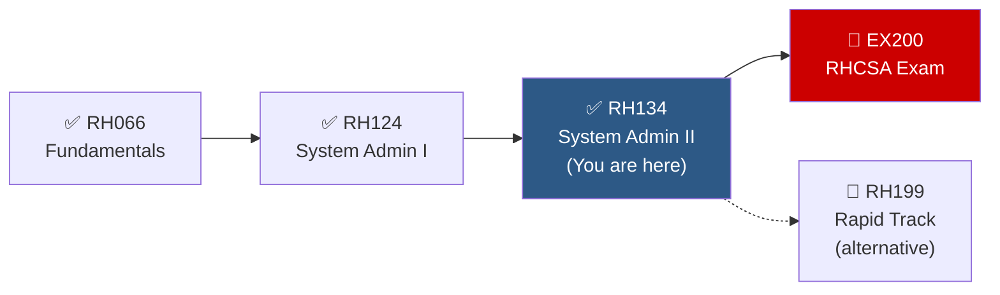

# 📘 RH134 — Red Hat System Administration II

> The second core course in the RHCSA track. Completes the skills needed for the EX200 exam — covering SELinux, advanced storage (LVM, Stratis), firewalld, shell scripting, containers with Podman, and boot troubleshooting.

---

## Course Overview

| | |
|---|---|
| **Code** | RH134 |
| **Duration** | 5 days (40 hours) |
| **Format** | Classroom, Virtual, Self-paced |
| **Prerequisites** | [[RH124-System-Administration-I]] or equivalent |
| **Certification** | → [[EX200-RHCSA]] (full prep with RH124 + RH134) |
| **Learning Path** | [[RHEL-SysAdmin-Path]] |

## Learning Objectives

After completing this course, you will be able to:
1. Write simple bash shell scripts to automate tasks
2. Schedule tasks with cron, at, and systemd timers
3. Tune system performance with tuned
4. Manage SELinux modes, contexts, and booleans
5. Manage partitions and disk storage
6. Create and manage logical volumes (LVM)
7. Use Stratis for simplified storage management
8. Access network storage with NFS and autofs
9. Control the boot process and reset the root password
10. Manage network security with firewalld
11. Run containers with Podman

---

## Module 1: Shell Scripting for Automation

### Bash Script Fundamentals

```bash
#!/bin/bash
# The shebang line (#!/bin/bash) tells the system which interpreter to use
# Make scripts executable: chmod +x script.sh
# Run: ./script.sh  or  bash script.sh
```

### Variables

```bash
#!/bin/bash

# Variable assignment (NO spaces around =)
NAME="RHEL Server"
COUNT=5
TODAY=$(date +%Y-%m-%d)       # Command substitution
HOSTNAME=$(hostname)

# Using variables
echo "Server: $NAME"
echo "Date: ${TODAY}"          # Braces for clarity / complex expansion
echo "There are ${COUNT} users"

# Special variables
echo "Script name: $0"
echo "First argument: $1"
echo "All arguments: $@"
echo "Number of arguments: $#"
echo "Last exit code: $?"
echo "PID of script: $$"
```

### Conditionals

```bash
#!/bin/bash

# if / elif / else
if [[ $# -eq 0 ]]; then
    echo "Usage: $0 <username>"
    exit 1
elif [[ $# -gt 1 ]]; then
    echo "Too many arguments"
    exit 1
else
    echo "Checking user: $1"
fi

# Test operators for numbers
# -eq  equal           -ne  not equal
# -lt  less than       -le  less or equal
# -gt  greater than    -ge  greater or equal

# Test operators for strings
# ==   equal           !=   not equal
# -z   empty string    -n   non-empty string

# Test operators for files
# -f   regular file exists     -d   directory exists
# -e   exists (any type)       -r   readable
# -w   writable                -x   executable
# -s   exists and size > 0     -L   symbolic link

# Example: check if a file exists
if [[ -f /etc/hostname ]]; then
    echo "Hostname: $(cat /etc/hostname)"
else
    echo "Hostname file not found!"
fi

# Compound conditions
if [[ -f /etc/httpd/conf/httpd.conf ]] && [[ -x /usr/sbin/httpd ]]; then
    echo "Apache is installed and configured"
fi
```

### Loops

```bash
#!/bin/bash

# for loop — iterate over a list
for USER in alice bob charlie; do
    echo "Creating user: $USER"
    sudo useradd "$USER" 2>/dev/null
done

# for loop — iterate over files
for FILE in /etc/*.conf; do
    echo "Config file: $FILE ($(wc -l < "$FILE") lines)"
done

# for loop — C-style
for ((i=1; i<=5; i++)); do
    echo "Iteration $i"
done

# for loop — sequence
for i in $(seq 1 10); do
    echo "Number: $i"
done

# while loop
COUNT=1
while [[ $COUNT -le 5 ]]; do
    echo "Count: $COUNT"
    ((COUNT++))
done

# while loop — read file line by line
while IFS= read -r LINE; do
    echo "Line: $LINE"
done < /etc/hostname

# until loop — runs until condition is true
until ping -c 1 -W 1 192.168.1.1 &>/dev/null; do
    echo "Waiting for gateway..."
    sleep 2
done
echo "Gateway is up!"
```

### Functions

```bash
#!/bin/bash

# Define function
check_service() {
    local SERVICE=$1        # local variable
    if systemctl is-active "$SERVICE" &>/dev/null; then
        echo "✅ $SERVICE is running"
        return 0
    else
        echo "❌ $SERVICE is NOT running"
        return 1
    fi
}

# Call function
check_service sshd
check_service httpd
```

### Exit Codes and Error Handling

```bash
#!/bin/bash

# Exit codes: 0 = success, 1-255 = failure
# Convention: 1 = general error, 2 = misuse, 126 = not executable, 127 = not found

set -e          # Exit on any error
set -u          # Error on undefined variables
set -o pipefail # Catch errors in pipes

# Or combine them:
set -euo pipefail

# Trap — run cleanup on exit
cleanup() {
    echo "Cleaning up temp files..."
    rm -f /tmp/mytemp.*
}
trap cleanup EXIT

# Check exit code
if ! sudo dnf install -y httpd; then
    echo "Failed to install httpd" >&2
    exit 1
fi
```

### Practice Exercise 1: System Report Script

```bash
#!/bin/bash
# system-report.sh — Generate a basic system report
set -euo pipefail

REPORT_FILE="/tmp/system-report-$(date +%Y%m%d).txt"

{
    echo "========================================="
    echo " System Report — $(date)"
    echo "========================================="
    echo ""
    echo "--- Hostname ---"
    hostnamectl
    echo ""
    echo "--- Uptime ---"
    uptime
    echo ""
    echo "--- Memory ---"
    free -h
    echo ""
    echo "--- Disk Usage ---"
    df -hT | grep -v tmpfs
    echo ""
    echo "--- Top 5 CPU Processes ---"
    ps aux --sort=-%cpu | head -6
    echo ""
    echo "--- Logged In Users ---"
    who
    echo ""
    echo "--- Failed Services ---"
    systemctl list-units --state=failed --no-legend
} > "$REPORT_FILE"

echo "Report saved to: $REPORT_FILE"
echo "Size: $(wc -c < "$REPORT_FILE") bytes"
```

---

## Module 2: Scheduling Tasks

### cron — Recurring Scheduled Tasks

```
# Crontab format:
# ┌───── minute (0-59)
# │ ┌───── hour (0-23)
# │ │ ┌───── day of month (1-31)
# │ │ │ ┌───── month (1-12 or jan-dec)
# │ │ │ │ ┌───── day of week (0-7 or sun-sat, 0 and 7 = Sunday)
# │ │ │ │ │
# * * * * *  command
```

```bash
# User crontab management
crontab -e                            # Edit your crontab
crontab -l                            # List your crontab
crontab -r                            # Remove your crontab
sudo crontab -e -u alice              # Edit alice's crontab

# Examples
# Run backup every day at 2:30 AM
30 2 * * * /opt/scripts/backup.sh

# Run every 15 minutes
*/15 * * * * /opt/scripts/monitor.sh

# Run at 9 AM on weekdays (Mon-Fri)
0 9 * * 1-5 /opt/scripts/report.sh

# Run on the 1st of every month at midnight
0 0 1 * * /opt/scripts/monthly-cleanup.sh

# Run every Sunday at 11 PM
0 23 * * 0 /opt/scripts/weekly-audit.sh
```

**System crontab files:**

| Location | Purpose |
|---|---|
| `/etc/crontab` | System crontab (includes user field) |
| `/etc/cron.d/` | Drop-in cron files |
| `/etc/cron.hourly/` | Scripts run hourly |
| `/etc/cron.daily/` | Scripts run daily |
| `/etc/cron.weekly/` | Scripts run weekly |
| `/etc/cron.monthly/` | Scripts run monthly |
| `/etc/cron.allow` | Users allowed to use cron (whitelist) |
| `/etc/cron.deny` | Users denied cron access (blacklist) |

### at — One-Time Scheduled Tasks

```bash
# Schedule a one-time job
at 14:30                              # At 2:30 PM today
at> /opt/scripts/deploy.sh
at> <Ctrl+D>                          # End input

at now + 30 minutes                   # 30 minutes from now
at now + 2 hours
at midnight
at 09:00 2025-12-25                   # Specific date and time

# Manage at jobs
atq                                    # List pending jobs
atrm 5                                 # Remove job #5
```

### Systemd Timers

Systemd timers are the modern replacement for cron on RHEL.

```bash
# List active timers
systemctl list-timers --all

# A timer consists of two unit files:
# 1. backup.timer  — when to run
# 2. backup.service — what to run
```

**Example: Create a custom timer**

```ini
# /etc/systemd/system/backup.service
[Unit]
Description=Daily backup job

[Service]
Type=oneshot
ExecStart=/opt/scripts/backup.sh
```

```ini
# /etc/systemd/system/backup.timer
[Unit]
Description=Run backup daily at 2:30 AM

[Timer]
OnCalendar=*-*-* 02:30:00
# Other options:
# OnBootSec=15min         ← 15 min after boot
# OnUnitActiveSec=1h      ← 1 hour after last run
Persistent=true            # Run missed executions after boot

[Install]
WantedBy=timers.target
```

```bash
# Enable and start the timer
sudo systemctl daemon-reload
sudo systemctl enable --now backup.timer
systemctl list-timers | grep backup
```

---

## Module 3: Tuning System Performance

### tuned — Adaptive System Tuning

```bash
# Install and enable
sudo dnf install tuned
sudo systemctl enable --now tuned

# List available profiles
tuned-adm list

# Common profiles
# balanced          — default, compromise between power and performance
# throughput-performance — max throughput (server workloads)
# latency-performance   — min latency (real-time workloads)
# virtual-guest     — optimized for VMs
# virtual-host      — optimized for hypervisors
# network-latency   — low network latency
# powersave         — max power saving

# View and change active profile
tuned-adm active                      # Show current profile
sudo tuned-adm profile throughput-performance  # Apply profile
tuned-adm recommend                   # Recommended profile for this system
```

### Process Priority Review

```bash
# Nice values: -20 (highest) to +19 (lowest)
nice -n 10 ./heavy-job.sh            # Start with lower priority
sudo renice -5 -p $(pgrep heavy-job)  # Boost running process

# Real-time scheduling (advanced)
sudo chrt -f 50 ./realtime-task       # FIFO scheduling, priority 50
```

---

## Module 4: Managing SELinux Security

### SELinux Concepts

**SELinux** (Security-Enhanced Linux) provides **Mandatory Access Control (MAC)** — an additional layer beyond standard file permissions.

```
Standard Linux permissions:   Who can access? (user/group/other)
SELinux:                       What type of access is allowed? (policy-based)

Even if file permissions say "world-readable", SELinux can still deny access
if the policy doesn't allow the process type to read that file type.
```

### SELinux Modes

| Mode | Behavior | Use Case |
|---|---|---|
| **Enforcing** | Enforces policy, denies and logs violations | Production (default) |
| **Permissive** | Logs violations but does NOT deny | Troubleshooting |
| **Disabled** | SELinux completely off | Not recommended |

```bash
# Check current mode
getenforce                            # Enforcing, Permissive, or Disabled
sestatus                              # Detailed SELinux status

# Change mode temporarily (until reboot)
sudo setenforce 0                     # Switch to Permissive
sudo setenforce 1                     # Switch to Enforcing

# Change mode permanently — edit /etc/selinux/config
sudo vim /etc/selinux/config
# SELINUX=enforcing                   ← set to enforcing, permissive, or disabled
```

> [!WARNING]
> Switching from `disabled` to `enforcing` requires a full filesystem relabel on next boot (can take a long time). Prefer `permissive` for troubleshooting instead of disabling.

### SELinux Contexts (Labels)

Every file, process, port, and user has an SELinux **context** (label):

```
# Format: user:role:type:level
# For files:
ls -Z /var/www/html/
# -rw-r--r--. root root unconfined_u:object_r:httpd_sys_content_t:s0 index.html
#                                              └──── This is the TYPE

# For processes:
ps auxZ | grep httpd
# system_u:system_r:httpd_t:s0  ... /usr/sbin/httpd
#                   └──── Process type (domain)

# SELinux decides: can process type 'httpd_t' access file type 'httpd_sys_content_t'?
# Answer: YES — policy allows it
```

### Managing File Contexts

```bash
# View file contexts
ls -Z /var/www/html/
ls -Zd /var/www/html/

# Change file context (temporary — lost on relabel)
sudo chcon -t httpd_sys_content_t /opt/website/index.html

# Change file context (permanent — survives relabel)
sudo semanage fcontext -a -t httpd_sys_content_t "/opt/website(/.*)?"
sudo restorecon -Rv /opt/website/
#   restorecon applies the policy defined by semanage

# Restore default context
sudo restorecon -Rv /var/www/html/

# List all file context rules
sudo semanage fcontext -l | grep httpd
```

### SELinux Booleans

Booleans are on/off switches that adjust SELinux policy without writing custom rules.

```bash
# List all booleans
getsebool -a
getsebool -a | grep httpd

# Check a specific boolean
getsebool httpd_enable_homedirs

# Set boolean temporarily (current session)
sudo setsebool httpd_enable_homedirs on

# Set boolean permanently
sudo setsebool -P httpd_enable_homedirs on

# List all booleans with descriptions
sudo semanage boolean -l | grep httpd
```

### SELinux Port Labels

```bash
# List port labels
sudo semanage port -l | grep http
# http_port_t    tcp    80, 81, 443, 488, 8008, 8009, 8443, 9000

# Add a custom port (e.g., run httpd on port 8888)
sudo semanage port -a -t http_port_t -p tcp 8888

# Verify
sudo semanage port -l | grep 8888
```

### Troubleshooting SELinux Denials

```bash
# Step 1: Check for denials in the audit log
sudo ausearch -m AVC -ts recent
# or
sudo grep "denied" /var/log/audit/audit.log | tail -5

# Step 2: Use sealert for human-readable analysis
sudo dnf install setroubleshoot-server    # If not installed
sudo sealert -a /var/log/audit/audit.log

# Step 3: Use audit2why to understand the denial
sudo ausearch -m AVC -ts recent | audit2why

# Step 4: Use audit2allow to generate a fix
sudo ausearch -m AVC -ts recent | audit2allow -M mypolicy
sudo semodule -i mypolicy.pp

# Typical troubleshooting workflow:
# 1. Is SELinux the problem? → setenforce 0 → test → setenforce 1
# 2. File context wrong? → restorecon -Rv /path
# 3. Boolean needed? → setsebool -P <boolean> on
# 4. Port label needed? → semanage port -a -t <type> -p tcp <port>
# 5. Custom policy needed? → audit2allow (last resort)
```

### Practice Exercise 2: SELinux Troubleshooting

```bash
# Scenario: Apache can't serve files from /opt/website

# 1. Set up the scenario
sudo dnf install -y httpd
sudo mkdir -p /opt/website
echo "<h1>Hello from /opt/website</h1>" | sudo tee /opt/website/index.html
# Configure httpd to use /opt/website as DocumentRoot
sudo sed -i 's|/var/www/html|/opt/website|g' /etc/httpd/conf/httpd.conf
sudo systemctl restart httpd

# 2. Test — you'll get a 403 Forbidden
curl http://localhost/

# 3. Check SELinux denials
sudo ausearch -m AVC -ts recent | tail

# 4. Fix the context
sudo semanage fcontext -a -t httpd_sys_content_t "/opt/website(/.*)?"
sudo restorecon -Rv /opt/website/

# 5. Verify
curl http://localhost/        # Should show the page now

# 6. Clean up
sudo systemctl stop httpd
```

**See also:** [[SELinux]] for a complete reference.

---

## Module 5: Managing Basic Storage

### Partition Types

| Scheme | Max Partitions | Max Disk Size | Notes |
|---|---|---|---|
| **MBR** (Master Boot Record) | 4 primary (or 3 primary + 1 extended) | 2 TB | Legacy BIOS boot |
| **GPT** (GUID Partition Table) | 128 | 8 ZB | Modern UEFI boot, recommended |

### Managing Partitions with fdisk and parted

```bash
# List partitions
sudo fdisk -l /dev/sda                # MBR/GPT partition info
sudo parted /dev/sda print            # parted — works with both MBR and GPT
lsblk                                  # Tree view

# Create partition with fdisk (interactive, MBR-friendly)
sudo fdisk /dev/sdb
#   n    ← new partition
#   p    ← primary (or e for extended)
#   1    ← partition number
#   (Enter) ← default first sector
#   +5G  ← size 5 GiB
#   w    ← write changes

# Create partition with parted (scriptable, GPT-friendly)
sudo parted /dev/sdb mklabel gpt                            # Create GPT label
sudo parted /dev/sdb mkpart primary xfs 1MiB 5GiB           # Create partition
sudo parted /dev/sdb set 1 lvm on                            # Set LVM flag

# Inform kernel of partition changes
sudo partprobe /dev/sdb

# Create filesystem and mount
sudo mkfs.xfs /dev/sdb1
sudo mkdir /data
sudo mount /dev/sdb1 /data

# Add to /etc/fstab for persistence
UUID=$(sudo blkid -s UUID -o value /dev/sdb1)
echo "UUID=$UUID  /data  xfs  defaults  0 0" | sudo tee -a /etc/fstab
sudo mount -a
```

### Swap Management

```bash
# Create swap partition
sudo fdisk /dev/sdb            # Create partition, type 82 (Linux swap)
sudo mkswap /dev/sdb2          # Format as swap
sudo swapon /dev/sdb2          # Activate
sudo swapon --show             # Verify

# Create swap file (alternative)
sudo dd if=/dev/zero of=/swapfile bs=1M count=1024
sudo chmod 600 /swapfile
sudo mkswap /swapfile
sudo swapon /swapfile

# Persist in /etc/fstab
# UUID=...  swap  swap  defaults  0 0
# or for swap file:
# /swapfile  swap  swap  defaults  0 0

# Set swap priority
sudo swapon -p 10 /dev/sdb2    # Higher number = higher priority
```

---

## Module 6: Managing Logical Volumes (LVM)

### LVM Architecture

```
Physical Disks                LVM Layer                      Filesystems
┌──────┐ ┌──────┐        ┌──────────────┐              ┌──────────────┐
│/dev/ │ │/dev/ │   PV   │   Volume     │     LV       │  Mounted     │
│sdb1  │→│  PV  │───────▶│   Group (VG) │────────────▶ │  Filesystem  │
│      │ │      │        │  "vg_data"   │              │  /data       │
└──────┘ └──────┘        │              │   ┌───────┐  └──────────────┘
                         │              │──▶│lv_data│──▶ /dev/vg_data/lv_data
┌──────┐ ┌──────┐        │              │   └───────┘
│/dev/ │ │/dev/ │   PV   │              │   ┌───────┐  ┌──────────────┐
│sdc1  │→│  PV  │───────▶│              │──▶│lv_logs│──▶ /var/log/app │
│      │ │      │        │              │   └───────┘  └──────────────┘
└──────┘ └──────┘        └──────────────┘

Key benefit: Logical volumes can be resized dynamically without unmounting!
```

### LVM Workflow — Creating Volumes

```bash
# Step 1: Create Physical Volumes (PV)
sudo pvcreate /dev/sdb1 /dev/sdc1
sudo pvs                              # List PVs (short)
sudo pvdisplay                         # List PVs (detailed)

# Step 2: Create Volume Group (VG) — pool of storage
sudo vgcreate vg_data /dev/sdb1 /dev/sdc1
sudo vgs                              # List VGs
sudo vgdisplay vg_data                # Detailed VG info

# Step 3: Create Logical Volumes (LV) — allocate from VG
sudo lvcreate -n lv_data -L 10G vg_data       # Fixed size
sudo lvcreate -n lv_logs -l 50%FREE vg_data    # 50% of remaining space
sudo lvs                              # List LVs
sudo lvdisplay                         # Detailed LV info

# Step 4: Create filesystem and mount
sudo mkfs.xfs /dev/vg_data/lv_data
sudo mkfs.ext4 /dev/vg_data/lv_logs
sudo mkdir -p /data /var/log/app
sudo mount /dev/vg_data/lv_data /data
sudo mount /dev/vg_data/lv_logs /var/log/app

# Step 5: Add to /etc/fstab
echo "/dev/vg_data/lv_data  /data         xfs   defaults  0 0" | sudo tee -a /etc/fstab
echo "/dev/vg_data/lv_logs  /var/log/app  ext4  defaults  0 0" | sudo tee -a /etc/fstab
```

### Resizing Logical Volumes

```bash
# Extend an LV — the KEY advantage of LVM
# For XFS (can only grow, not shrink):
sudo lvextend -L +5G /dev/vg_data/lv_data      # Add 5 GB
sudo xfs_growfs /data                            # Grow the XFS filesystem

# Or do both in one command:
sudo lvextend -L +5G -r /dev/vg_data/lv_data    # -r = resize filesystem too

# For ext4 (can grow AND shrink):
sudo lvextend -L +5G -r /dev/vg_data/lv_logs     # Extend
sudo lvreduce -L 3G -r /dev/vg_data/lv_logs      # Shrink to 3 GB (CAREFUL!)

# Extend the Volume Group (add more disks)
sudo pvcreate /dev/sdd1
sudo vgextend vg_data /dev/sdd1
sudo vgs                              # Verify increased VG size
```

> [!WARNING]
> **XFS cannot be shrunk** — only grown. If you need to shrink, use ext4.
> Always back up data before shrinking any filesystem.

### LVM Removal

```bash
# Remove in reverse order: unmount → remove LV → remove VG → remove PV
sudo umount /data
sudo lvremove /dev/vg_data/lv_data
sudo vgremove vg_data
sudo pvremove /dev/sdb1 /dev/sdc1
```

### Practice Exercise 3: LVM

```bash
# Scenario: Create a logical volume, mount it, then extend it

# 1. Create PV (use a loop device if no spare disk)
sudo dd if=/dev/zero of=/tmp/lvm-disk.img bs=1M count=200
sudo losetup /dev/loop0 /tmp/lvm-disk.img
sudo pvcreate /dev/loop0

# 2. Create VG and LV
sudo vgcreate vg_lab /dev/loop0
sudo lvcreate -n lv_test -L 100M vg_lab

# 3. Format and mount
sudo mkfs.xfs /dev/vg_lab/lv_test
sudo mkdir /mnt/lvm-test
sudo mount /dev/vg_lab/lv_test /mnt/lvm-test
df -h /mnt/lvm-test

# 4. Extend the LV
sudo lvextend -L +50M -r /dev/vg_lab/lv_test
df -h /mnt/lvm-test         # Should show larger size

# 5. Clean up
sudo umount /mnt/lvm-test
sudo lvremove -y /dev/vg_lab/lv_test
sudo vgremove vg_lab
sudo pvremove /dev/loop0
sudo losetup -d /dev/loop0
rm /tmp/lvm-disk.img
```

**See also:** [[Storage-LVM-Stratis]] for a complete LVM reference.

---

## Module 7: Implementing Advanced Storage

### Stratis — Simplified Storage Management

Stratis provides a ZFS/Btrfs-like experience on RHEL using thin-provisioning, snapshots, and automatic filesystem management.

```
┌────────────────────────────────────┐
│           Stratis Pool             │
│   (aggregates block devices)       │
│ ┌──────────┐ ┌──────────┐        │
│ │ /dev/sdb │ │ /dev/sdc │        │
│ └──────────┘ └──────────┘        │
│                                    │
│   ┌─────────────┐  ┌──────────┐  │
│   │  Filesystem  │  │Filesystem│  │
│   │  "data-fs"   │  │"logs-fs" │  │
│   │  (thin prov) │  │          │  │
│   └─────────────┘  └──────────┘  │
└────────────────────────────────────┘
```

```bash
# Install Stratis
sudo dnf install stratisd stratis-cli
sudo systemctl enable --now stratisd

# Create a pool (aggregates disks)
sudo stratis pool create mypool /dev/sdb /dev/sdc

# Add more disks to a pool
sudo stratis pool add-data mypool /dev/sdd

# Create filesystems (thin-provisioned XFS)
sudo stratis filesystem create mypool data-fs
sudo stratis filesystem create mypool logs-fs

# Mount (device path is long — use symlink or UUID)
sudo mkdir /data
sudo mount /dev/stratis/mypool/data-fs /data

# For /etc/fstab — MUST use x-systemd.requires=stratisd.service
UUID=$(sudo blkid -s UUID -o value /dev/stratis/mypool/data-fs)
echo "UUID=$UUID  /data  xfs  defaults,x-systemd.requires=stratisd.service  0 0" | sudo tee -a /etc/fstab

# Snapshots
sudo stratis filesystem snapshot mypool data-fs data-fs-snap

# List objects
stratis pool list
stratis filesystem list
stratis blockdev list

# Destroy filesystem
sudo umount /data
sudo stratis filesystem destroy mypool data-fs
sudo stratis pool destroy mypool
```

### VDO (Virtual Data Optimizer) — Deduplication and Compression

```bash
# VDO is now integrated into LVM as LVM-VDO in RHEL 9
sudo lvcreate --type vdo -n vdo_lv -L 50G --virtualsize 100G vg_data
#   -L 50G         ← actual physical size
#   --virtualsize  ← virtual (logical) size (can be larger due to dedup/compression)

sudo mkfs.xfs /dev/vg_data/vdo_lv
sudo mount /dev/vg_data/vdo_lv /vdo-data

# Monitor VDO stats
sudo vdostats --human-readable
```

---

## Module 8: Accessing Network-Attached Storage

### NFS — Network File System

```bash
# Client-side: Mount an NFS share

# Install NFS client
sudo dnf install nfs-utils

# Discover exports from server
showmount -e nfs-server.example.com

# Mount manually
sudo mkdir /mnt/nfs-share
sudo mount -t nfs nfs-server.example.com:/export/data /mnt/nfs-share

# Persist in /etc/fstab
# server:/share   /mount/point  nfs  defaults,_netdev  0 0
echo "nfs-server:/export/data  /mnt/nfs-share  nfs  defaults,_netdev  0 0" | sudo tee -a /etc/fstab
```

### autofs — Automatic Mounting on Demand

```bash
# Install autofs
sudo dnf install autofs

# Configure: define a master map and an indirect map

# 1. Master map: /etc/auto.master.d/shares.autofs
echo "/shares  /etc/auto.shares" | sudo tee /etc/auto.master.d/shares.autofs

# 2. Indirect map: /etc/auto.shares
# key  options  location
echo "data  -rw,sync  nfs-server:/export/data" | sudo tee /etc/auto.shares
echo "docs  -ro       nfs-server:/export/docs" | sudo tee -a /etc/auto.shares

# 3. Start autofs
sudo systemctl enable --now autofs

# 4. Access — mounting happens automatically!
ls /shares/data               # Triggers mount
ls /shares/docs               # Triggers mount

# Direct maps (absolute path mounting)
echo "/-  /etc/auto.direct" | sudo tee /etc/auto.master.d/direct.autofs
echo "/opt/nfs-data  -rw  nfs-server:/export/data" | sudo tee /etc/auto.direct
sudo systemctl restart autofs
```

---

## Module 9: Controlling the Boot Process

### RHEL Boot Sequence

```
┌──────────┐    ┌──────────┐    ┌──────────┐    ┌──────────┐    ┌──────────┐
│ Firmware │───▶│ GRUB2    │───▶│ Kernel + │───▶│ systemd  │───▶│ Default  │
│ (UEFI/   │    │Bootloader│    │ initramfs│    │ (PID 1)  │    │ Target   │
│  BIOS)   │    │          │    │          │    │          │    │          │
└──────────┘    └──────────┘    └──────────┘    └──────────┘    └──────────┘
```

### GRUB2 Configuration

```bash
# GRUB config files
# /etc/default/grub              ← Edit this file
# /boot/grub2/grub.cfg           ← Generated — do NOT edit directly

# View current defaults
cat /etc/default/grub

# Common /etc/default/grub settings:
# GRUB_TIMEOUT=5                  # Boot menu timeout (seconds)
# GRUB_DEFAULT=saved              # Boot the saved (last-selected) kernel
# GRUB_CMDLINE_LINUX="..."        # Kernel boot parameters

# After editing /etc/default/grub, regenerate:
sudo grub2-mkconfig -o /boot/grub2/grub.cfg        # BIOS
sudo grub2-mkconfig -o /boot/efi/EFI/redhat/grub.cfg  # UEFI

# List available kernels
sudo grubby --info=ALL

# Set default kernel
sudo grubby --set-default /boot/vmlinuz-5.14.0-...
```

### Resetting the Root Password (CRITICAL EXAM SKILL)

```
1. Reboot the system
2. At GRUB menu, press 'e' to edit the boot entry
3. Find the line starting with 'linux' (kernel command line)
4. Append: rd.break
5. Press Ctrl+X to boot

# You are now in the initramfs emergency shell
# The real root filesystem is mounted read-only at /sysroot

6. Remount /sysroot as read/write:
   switch_root:/# mount -o remount,rw /sysroot

7. Change root into /sysroot:
   switch_root:/# chroot /sysroot

8. Reset the password:
   sh-5.1# passwd root

9. Trigger SELinux relabel on next boot:
   sh-5.1# touch /.autorelabel

10. Exit and reboot:
    sh-5.1# exit
    switch_root:/# exit
    # System reboots and relabels (may take a few minutes)
```

> [!IMPORTANT]
> **Step 9 is critical!** Without `touch /.autorelabel`, SELinux contexts on `/etc/shadow` will be wrong, and you won't be able to log in even with the new password.

### Repair a Broken /etc/fstab

```bash
# If system won't boot due to bad fstab entry:
# 1. At GRUB menu, edit kernel line, append: systemd.unit=emergency.target
# 2. Boot — you get a root shell
# 3. Fix /etc/fstab
# 4. Verify: mount -a
# 5. Reboot: systemctl reboot
```

---

## Module 10: Managing Network Security (firewalld)

### Firewalld Concepts

```
            ┌──────────────────────────────────┐
            │           firewalld               │
            │    (manages nftables backend)     │
            │                                    │
            │  ┌────────┐ ┌────────┐ ┌────────┐│
            │  │ Zone:  │ │ Zone:  │ │ Zone:  ││
            │  │ public │ │trusted │ │ dmz    ││
            │  │(default│ │        │ │        ││
            │  └────────┘ └────────┘ └────────┘│
            └──────────────────────────────────┘
            
Each network interface is assigned to a ZONE.
Each zone has a set of rules (allowed services, ports, etc.)
```

**Common Zones:**

| Zone | Default Behavior |
|---|---|
| `public` | Default zone. Only selected services allowed |
| `trusted` | All traffic accepted |
| `block` | All incoming rejected (ICMP error) |
| `drop` | All incoming dropped silently |
| `dmz` | For DMZ servers — limited incoming |
| `home` | Trusted home network |
| `work` | Trusted work network |
| `internal` | Internal network |
| `external` | External/NAT with masquerading |

### firewall-cmd — Managing Firewalld

```bash
# Status
sudo firewall-cmd --state                  # running or not running
sudo firewall-cmd --get-active-zones       # Which zones are active
sudo firewall-cmd --get-default-zone       # Default zone
sudo firewall-cmd --list-all               # All rules in default zone
sudo firewall-cmd --list-all --zone=dmz    # Rules in specific zone

# Managing services
sudo firewall-cmd --add-service=http                   # Allow HTTP (runtime only)
sudo firewall-cmd --add-service=http --permanent       # Allow HTTP (persistent)
sudo firewall-cmd --remove-service=http --permanent
sudo firewall-cmd --reload                              # Apply permanent changes

# ALWAYS use --permanent + --reload for persistent changes:
sudo firewall-cmd --permanent --add-service=https
sudo firewall-cmd --permanent --add-service=http
sudo firewall-cmd --reload

# Managing ports
sudo firewall-cmd --permanent --add-port=8080/tcp       # Open port 8080/tcp
sudo firewall-cmd --permanent --add-port=5000-5100/tcp  # Port range
sudo firewall-cmd --reload

# List available services
sudo firewall-cmd --get-services               # All predefined services

# Change default zone
sudo firewall-cmd --set-default-zone=dmz

# Assign interface to zone
sudo firewall-cmd --zone=dmz --change-interface=ens224 --permanent

# Rich rules (advanced)
sudo firewall-cmd --permanent --add-rich-rule='rule family="ipv4" source address="192.168.1.0/24" service name="ssh" accept'
sudo firewall-cmd --permanent --add-rich-rule='rule family="ipv4" source address="10.0.0.0/8" port port="3306" protocol="tcp" accept'
sudo firewall-cmd --reload
```

### Practice Exercise 4: Firewall Configuration

```bash
# 1. Check current configuration
sudo firewall-cmd --list-all

# 2. Allow HTTP and HTTPS permanently
sudo firewall-cmd --permanent --add-service=http
sudo firewall-cmd --permanent --add-service=https
sudo firewall-cmd --reload

# 3. Open a custom port
sudo firewall-cmd --permanent --add-port=8443/tcp
sudo firewall-cmd --reload

# 4. Verify
sudo firewall-cmd --list-all

# 5. Add a rich rule to allow SSH only from a specific subnet
sudo firewall-cmd --permanent --add-rich-rule='rule family="ipv4" source address="192.168.1.0/24" service name="ssh" accept'
sudo firewall-cmd --reload

# 6. Verify rich rules
sudo firewall-cmd --list-rich-rules
```

**See also:** [[Firewall-and-Security]] for advanced firewalld topics.

---

## Module 11: Running Containers with Podman

### Container Concepts

```
┌──────────────────────────────────────────┐
│              Container Host (RHEL)        │
│                                          │
│  ┌──────────┐  ┌──────────┐  ┌────────┐│
│  │Container │  │Container │  │Contain.││
│  │  httpd   │  │  mariadb │  │  app   ││
│  │ :8080    │  │ :3306    │  │ :5000  ││
│  └──────────┘  └──────────┘  └────────┘│
│                                          │
│  ┌──────────────────────────────────┐   │
│  │    Shared Linux Kernel            │   │
│  │    (namespaces + cgroups)         │   │
│  └──────────────────────────────────┘   │
└──────────────────────────────────────────┘

Unlike VMs, containers share the host kernel.
They are isolated using:
  - Namespaces (PID, network, mount, user)
  - Cgroups (CPU, memory limits)
```

### Podman — Rootless Container Engine

```bash
# Why Podman (not Docker)?
# - Daemonless — no background daemon needed
# - Rootless — run containers as regular user (no root!)
# - CLI-compatible with Docker (podman = drop-in replacement)
# - Integrated with systemd

# Verify installation
podman --version
podman info
```

### Working with Container Images

```bash
# Search for images
podman search httpd
podman search --list-tags registry.access.redhat.com/ubi9/httpd-24

# Pull images
podman pull registry.access.redhat.com/ubi9/ubi        # Red Hat UBI (Universal Base Image)
podman pull docker.io/library/nginx                     # Docker Hub
podman pull registry.access.redhat.com/ubi9/httpd-24    # Red Hat httpd

# List local images
podman images

# Inspect an image
podman inspect registry.access.redhat.com/ubi9/ubi

# Remove images
podman rmi <image-id>
podman rmi --all                     # Remove all images
```

### Running Containers

```bash
# Run a basic container
podman run registry.access.redhat.com/ubi9/ubi cat /etc/os-release

# Run interactively
podman run -it registry.access.redhat.com/ubi9/ubi /bin/bash
# exit to leave

# Run as a background daemon
podman run -d --name myweb -p 8080:8080 registry.access.redhat.com/ubi9/httpd-24
#   -d          ← detached (background)
#   --name      ← container name
#   -p 8080:8080 ← port mapping (host:container)

# Verify
podman ps                             # List running containers
podman ps -a                          # All containers (including stopped)
curl http://localhost:8080             # Test the web server

# Container lifecycle
podman stop myweb                     # Stop container
podman start myweb                    # Start again
podman restart myweb                  # Restart
podman rm myweb                       # Remove (must be stopped)
podman rm -f myweb                    # Force remove (even if running)

# Exec into running container
podman exec -it myweb /bin/bash

# View logs
podman logs myweb
podman logs -f myweb                  # Follow (live)

# Resource usage
podman stats                          # Real-time stats for all containers
```

### Environment Variables and Volumes

```bash
# Pass environment variables
podman run -d --name mydb \
    -e MYSQL_ROOT_PASSWORD=redhat123 \
    -e MYSQL_DATABASE=appdb \
    -p 3306:3306 \
    docker.io/library/mariadb

# Mount host directory into container
podman run -d --name myweb \
    -p 8080:8080 \
    -v /opt/website:/var/www/html:Z \
    registry.access.redhat.com/ubi9/httpd-24
#   -v host:container:Z  ← :Z applies correct SELinux context automatically

# Named volumes (managed by Podman)
podman volume create mydata
podman run -d --name myapp -v mydata:/app/data myimage
podman volume ls
podman volume inspect mydata
```

### Building Custom Container Images

```bash
# Containerfile (= Dockerfile)
cat > Containerfile << 'EOF'
FROM registry.access.redhat.com/ubi9/ubi
RUN dnf install -y httpd && dnf clean all
COPY index.html /var/www/html/
EXPOSE 80
CMD ["/usr/sbin/httpd", "-D", "FOREGROUND"]
EOF

echo "<h1>My Custom Container</h1>" > index.html

# Build the image
podman build -t myapp:v1 .

# Run the custom image
podman run -d --name myapp -p 8080:80 myapp:v1
```

### Running Containers as Systemd Services

```bash
# Generate a systemd unit file for a rootless container
mkdir -p ~/.config/systemd/user
podman generate systemd --name myweb --new --files
mv container-myweb.service ~/.config/systemd/user/

# Enable and start
systemctl --user daemon-reload
systemctl --user enable --now container-myweb.service

# Enable lingering (keep user services running after logout)
loginctl enable-linger $USER

# Check status
systemctl --user status container-myweb.service

# For root containers, use /etc/systemd/system/ instead
```

### Practice Exercise 5: Container Workflow

```bash
# 1. Pull and run a web server container
podman run -d --name labweb -p 8080:8080 \
    registry.access.redhat.com/ubi9/httpd-24

# 2. Verify it's running
podman ps
curl http://localhost:8080

# 3. View logs
podman logs labweb

# 4. Exec into the container
podman exec -it labweb /bin/bash
# Inside: ls /var/www/html/
# exit

# 5. Stop and remove
podman stop labweb
podman rm labweb

# 6. Clean up images
podman rmi registry.access.redhat.com/ubi9/httpd-24
```

**See also:** [[Podman-and-Containers]] for advanced container topics.

---

## Course Summary

| Module | Key Skills | Related Notes |
|---|---|---|
| 1. Shell Scripting | Variables, conditionals, loops, functions | [[System-Administration]] |
| 2. Scheduling | cron, at, systemd timers | [[Systemd]] |
| 3. Performance Tuning | tuned profiles, nice/renice | — |
| 4. SELinux | Modes, contexts, booleans, troubleshooting | [[SELinux]] |
| 5. Basic Storage | Partitions (fdisk, parted), swap | [[Storage-LVM-Stratis]] |
| 6. LVM | PV → VG → LV, extend, resize | [[Storage-LVM-Stratis]] |
| 7. Advanced Storage | Stratis, VDO (LVM-VDO) | [[Storage-LVM-Stratis]] |
| 8. Network Storage | NFS, autofs | [[Networking-Linux]] |
| 9. Boot Process | GRUB2, root password reset, repair fstab | — |
| 10. Firewalld | Zones, services, ports, rich rules | [[Firewall-and-Security]] |
| 11. Containers | Podman, images, volumes, systemd integration | [[Podman-and-Containers]] |

---

## Exam Mapping

With RH124 + RH134 combined, you now cover **~100%** of [[EX200-RHCSA]] exam objectives:

| EX200 Objective | RH124 | RH134 |
|---|---|---|
| Essential tools (grep, find, vim, etc.) | ✅ | — |
| Create and manage users/groups | ✅ | — |
| File permissions | ✅ | ✅ (ACLs, special perms) |
| Manage systemd services | ✅ | ✅ (timers) |
| Configure networking | ✅ | — |
| Manage software (DNF) | ✅ | — |
| Access file systems | ✅ | ✅ (LVM, Stratis, NFS) |
| SELinux | — | ✅ |
| Shell scripting | — | ✅ |
| Containers (Podman) | — | ✅ |
| Firewalld | — | ✅ |
| Boot process / password reset | — | ✅ |
| Storage (LVM, Stratis) | — | ✅ |
| Scheduled tasks | — | ✅ |

> [!TIP]
> You are now ready to study for the **EX200 RHCSA exam**. See [[EX200-RHCSA]] for the detailed study guide.

---

## What's Next?



→ Take the exam: [[EX200-RHCSA]]
→ Alternative: [[RH199-RHCSA-Rapid-Track]] (accelerated RH124 + RH134)
→ Back to [[RHEL-SysAdmin-Path]]

---

## Related Notes

- [[SELinux]] — SELinux reference
- [[Storage-LVM-Stratis]] — LVM, Stratis, VDO reference
- [[Firewall-and-Security]] — Firewalld reference
- [[Podman-and-Containers]] — Container reference
- [[Systemd]] — Systemd units, timers, targets
- [[System-Administration]] — General sysadmin reference
- [[RHEL-SysAdmin-Path]] — Full learning path

## References

- [RH134 Official Course Page](https://www.redhat.com/en/services/training/rh134-red-hat-system-administration-ii)
- [RHEL 9 Documentation](https://access.redhat.com/documentation/en-us/red_hat_enterprise_linux/9)
- [EX200 Exam Objectives](https://www.redhat.com/en/services/training/ex200-red-hat-certified-system-administrator-rhcsa-exam)
- [Red Hat Interactive Labs](https://lab.redhat.com/)
