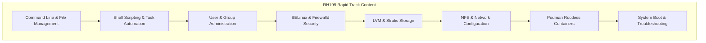

# 📙 RH199 — RHCSA Rapid Track Course

> An accelerated course designed for experienced Linux system administrators. It combines the core content of both [[RH124-System-Administration-I]] and [[RH134-System-Administration-II]] into a single, fast-paced 5-day session.

---

## Course Overview

| | |
|---|---|
| **Code** | RH199 |
| **Duration** | 5 days (40 hours - high intensity) |
| **Format** | Classroom, Virtual, Self-paced |
| **Prerequisites** | 1-3 years of full-time Linux admin experience |
| **Certification** | → [[EX200-RHCSA]] (direct preparation) |
| **Learning Path** | [[RHEL-SysAdmin-Path]] |

## Target Audience

This course is designed for:
- Experienced Linux administrators who need to review or validate their skills on Red Hat Enterprise Linux.
- Sysadmins transitioning from other Unix/Linux flavors who need to learn RHEL-specific features (systemd, NetworkManager, firewalld, SELinux, Stratis, Podman).
- Anyone aiming to fast-track their preparation for the [[EX200-RHCSA]] exam.

---

## Combined Course Outline & Reference Map

Since RH199 is a fast-track version of RH124 and RH134, the course content is condensed into the following key competencies. Refer to the respective modules in the main courses for detailed command syntax, explanations, and exercises:

### 1. Essential Tools & File Management
*Fast-tracks command line utilities, archiving, and editing.*
- **Key Skills:** Text processing (`grep`, `awk`, `sed`), navigation, and basic file operations.
- **Detailed Reference:** [[RH124-System-Administration-I#Module-1-Accessing-the-Command-Line|RH124 Module 1]], [[RH124-System-Administration-I#Module-2-Managing-Files-from-the-Command-Line|RH124 Module 2]], and [[RH124-System-Administration-I#Module-3-Editing-Text-Files|RH124 Module 3]].

### 2. User, Group, and Permission Security
*Covers identity management, standard permissions, special permissions, and ACLs.*
- **Key Skills:** Command line user administration, configuring supplementary groups, managing default permissions via `umask`, setting SUID/SGID/sticky bits, and configuring user-specific permissions.
- **Detailed Reference:** [[RH124-System-Administration-I#Module-4-Managing-Local-Users-and-Groups|RH124 Module 4]], [[RH124-System-Administration-I#Module-5-Controlling-Access-to-Files|RH124 Module 5]], and [[RH134-System-Administration-II#Module-1-Shell-Scripting-for-Automation|RH134 Module 1]].

### 3. SELinux & Firewalld Configuration
*Focuses on RHEL security primitives.*
- **Key Skills:** Modifying SELinux contexts, setting boolean policy toggles, mapping ports, and configuring firewalld zones, services, and rich rules.
- **Detailed Reference:** [[RH134-System-Administration-II#Module-4-Managing-SELinux-Security|RH134 Module 4]] and [[RH134-System-Administration-II#Module-10-Managing-Network-Security-firewalld|RH134 Module 10]].

### 4. Advanced Storage: LVM, Stratis, and Mounts
*Covers partitioned storage, dynamic volume management, and modern thin-provisioned pools.*
- **Key Skills:** Partitioning with `gdisk`/`parted`, building Physical Volumes, Volume Groups, and Logical Volumes, dynamically resizing file systems, configuring Stratis pools/filesystems, and managing persistent mounts in `/etc/fstab`.
- **Detailed Reference:** [[RH134-System-Administration-II#Module-5-Managing-Basic-Storage|RH134 Module 5]], [[RH134-System-Administration-II#Module-6-Managing-Logical-Volumes-LVM|RH134 Module 6]], and [[RH134-System-Administration-II#Module-7-Implementing-Advanced-Storage|RH134 Module 7]].

### 5. Network Configuration & Services
*Managing IP addresses, gateways, DNS, systemd, and logs.*
- **Key Skills:** Using `nmcli` for static/DHCP connection profiles, hostname resolution, controlling systemd services, managing boot targets, and using `journalctl` for log analysis.
- **Detailed Reference:** [[RH124-System-Administration-I#Module-7-Controlling-Services-and-Daemons|RH124 Module 7]], [[RH124-System-Administration-I#Module-9-Analyzing-and-Storing-Logs|RH124 Module 9]], and [[RH124-System-Administration-I#Module-10-Managing-Networking|RH124 Module 10]].

### 6. Shell Scripting and Automation
*Writing robust scripts to automate standard operating procedures.*
- **Key Skills:** Script flow, loops, environment variables, exit status checks, and command parameters.
- **Detailed Reference:** [[RH134-System-Administration-II#Module-1-Shell-Scripting-for-Automation|RH134 Module 1]] and [[RH134-System-Administration-II#Module-2-Scheduling-Tasks|RH134 Module 2]].

### 7. Rootless Containers (Podman)
*Running lightweight, sandboxed applications without root privileges.*
- **Key Skills:** Pulling images, configuring port mapping, persistent host volumes, writing Containerfiles, and running container applications as systemd user services.
- **Detailed Reference:** [[RH134-System-Administration-II#Module-11-Running-Containers-with-Podman|RH134 Module 11]].

### 8. System Boot Troubleshooting
*Recovering systems that fail to start.*
- **Key Skills:** Interrupting GRUB2, booting into emergency target/rd.break, mounting filesystems read-write, resetting root passwords, and fixing incorrect `/etc/fstab` storage entries.
- **Detailed Reference:** [[RH134-System-Administration-II#Module-9-Controlling-the-Boot-Process|RH134 Module 9]].

---

## Rapid Review Checklist for the Exam

Before scheduling your [[EX200-RHCSA]] exam, ensure you can perform the following tasks quickly and without references:

- [ ] Reset the root password using `rd.break` under 3 minutes.
- [ ] Configure a static IP address, gateway, and DNS server using `nmcli`.
- [ ] Create a shell script that searches for files of a specific pattern and copies them.
- [ ] Configure `cron` or a `systemd` timer to execute a script at a specific interval.
- [ ] Create a 2GB Logical Volume, format it as XFS, mount it, and then extend it to 4GB online.
- [ ] Add a persistent entry in `/etc/fstab` using the device UUID and verify it doesn't break boot.
- [ ] Configure a directory to enforce group ownership on all new files using SGID.
- [ ] Block incoming port requests or allow a service (like HTTPS) persistently in the firewall.
- [ ] Change a file's SELinux context type and make the context change survive a filesystem relabel.
- [ ] Build a Containerfile, build a custom image, and run a rootless container that starts at boot via systemd.

---

## Related Notes

- [[RH124-System-Administration-I]] — Full detail on basic commands, networks, services, and DNF
- [[RH134-System-Administration-II]] — Full detail on scripting, SELinux, storage, containers, and boot recovery
- [[EX200-RHCSA]] — Exam details and practice labs
- [[RHEL-SysAdmin-Path]] — Red Hat Enterprise Linux system administrator learning path
