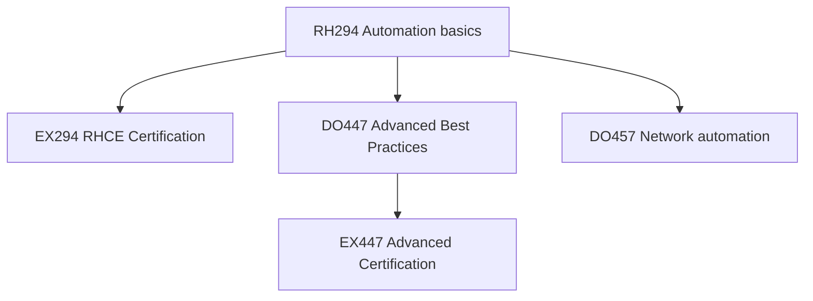

# 📖 Ansible Automation Courses

> Course materials for the Ansible Automation learning path. Each note contains detailed playbooks, modules reference, and automation best practices.

---

## Core Curriculum

| Course | Title | Duration | Certification |
|---|---|---|---|
| [[RH294-Ansible-Automation]] | Linux Automation with Ansible | 5 days | → [[EX294-Ansible]] (RHCE) |
| [[DO447-Advanced-Ansible]] | Advanced Automation: Ansible Best Practices | 5 days | → [[EX447-Advanced-Ansible]] |
| [[DO457-Network-Automation]] | Ansible for Network Automation | 5 days | — |

---

## Study Track & Certifications

The Ansible Automation curriculum builds enterprise orchestration capabilities from foundation to advanced controls:

- [[EX294-Ansible]] — Red Hat Certified Engineer (RHCE) exam guide. Focuses on core loops, vars, roles, template constructs, and vault files.
- [[EX447-Advanced-Ansible]] — Advanced Specialist exam guide. Focuses on block/rescue, serial rolls, delegation, and AAP Controller.

---

## Learning Path

→ [[Ansible-Automation-Path]] — Full automation engineer MOC
