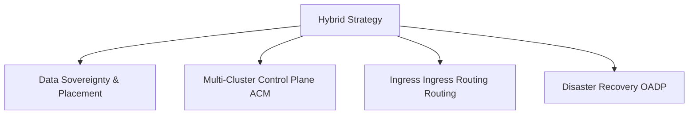

# ☁️ Hybrid Cloud Strategy with OpenShift

> Guidelines and architectural decision matrices for building consistent, hybrid container environments using Red Hat OpenShift across public clouds and on-premises datacenters.

---

## Architectural Comparison Matrix

| Architecture | Control Plane | Worker Nodes | Best Fit For |
|---|---|---|---|
| **Self-Managed Bare-Metal** | User Managed | User Managed | High performance, legacy storage integrations, latency-critical apps |
| **Self-Managed Virtualized** | User Managed (VMs) | User Managed (VMs) | General enterprise workloads in datacenters (VMware/Nutanix) |
| **Public Cloud Self-Managed** | User Managed | User Managed | Customized cloud infrastructure (IPI/UPI on AWS/Azure) |
| **Public Cloud Fully Managed** | Red Hat SRE Managed | Jointly Managed | Minimum operational overhead (ROSA, ARO) |

---

## Key Design Considerations

### 1. Networking & IP Routing
- **mTLS:** Encrypt communications crossing clouds using OpenShift Service Mesh.
- **Dynamic Routing:** Use Submariner (integrated with ACM) to establish secure IP routing tunnels directly between pods in different clouds.

### 2. Multi-Cluster Fleet Governance
- Deploy **Red Hat Advanced Cluster Management (ACM)** on a central hub cluster to push policies, applications, and configurations consistently across all environments.

### 3. Data Integration
- Ceph-backed **OpenShift Data Foundation (ODF)** replicates stateful block and file storage volumes across zones, enabling seamless disaster recovery.

---

## Related Notes
- [[ROSA-Red-Hat-OpenShift-on-AWS]] — Managed AWS option
- [[ARO-Azure-Red-Hat-OpenShift]] — Managed Azure option
- [[OpenShift-Dedicated]] — Managed Dedicated OSD
- [[ACM-Advanced-Cluster-Management]] — Fleet governance MOC
