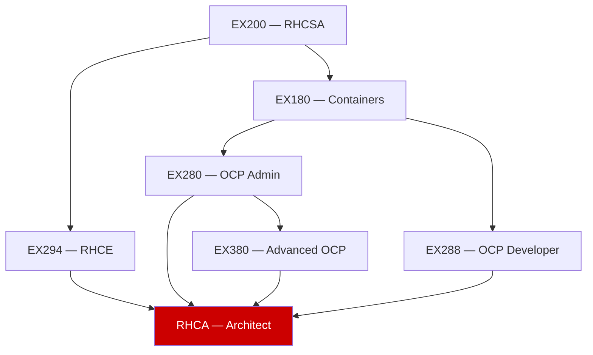

# 🎓 Certifications

## Exam Study Guides
- [[EX180-Containers-Kubernetes]] — Red Hat Certified Technologist in OpenShift
- [[EX200-RHCSA]] — Red Hat Certified System Administrator
- [[EX280-OpenShift-Admin]] — Red Hat Certified OpenShift Administrator
- [[EX380-OpenShift-Advanced]] — Advanced System Administrator in OpenShift
- [[EX288-OpenShift-Developer]] — Red Hat Certified OpenShift Application Developer
- [[EX294-Ansible]] — Red Hat Certified Engineer (Ansible)
- [[Study-Tips-and-Resources]] — General exam preparation strategies

## Certification Hierarchy

