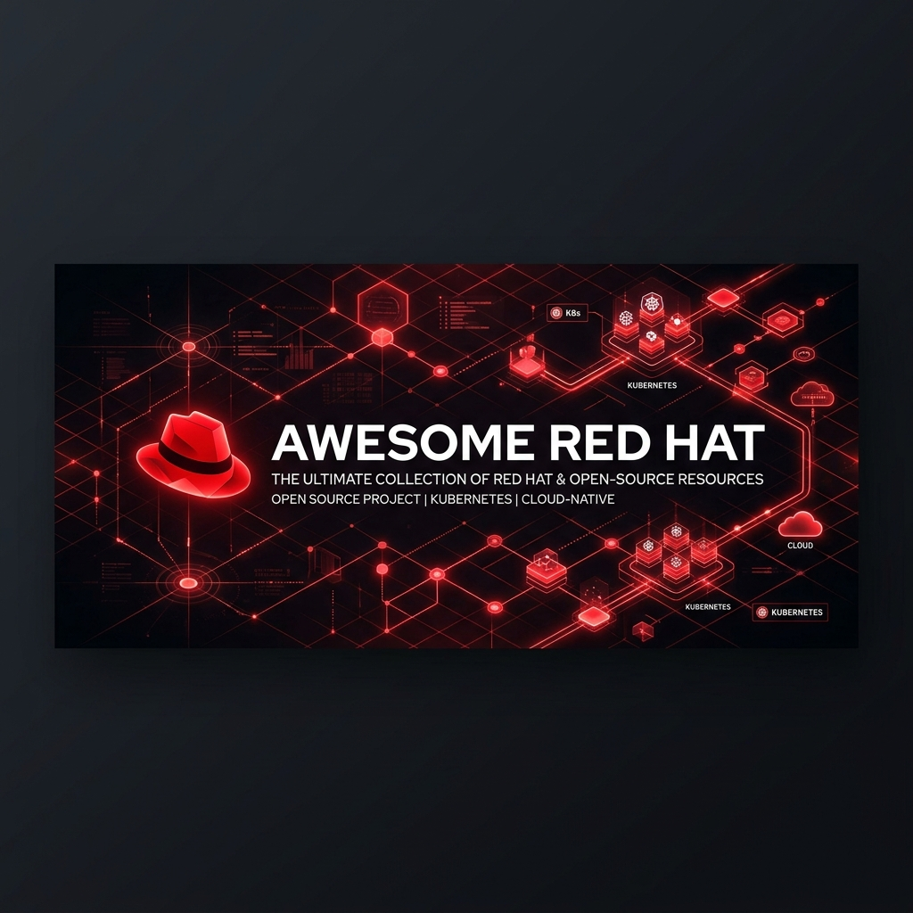
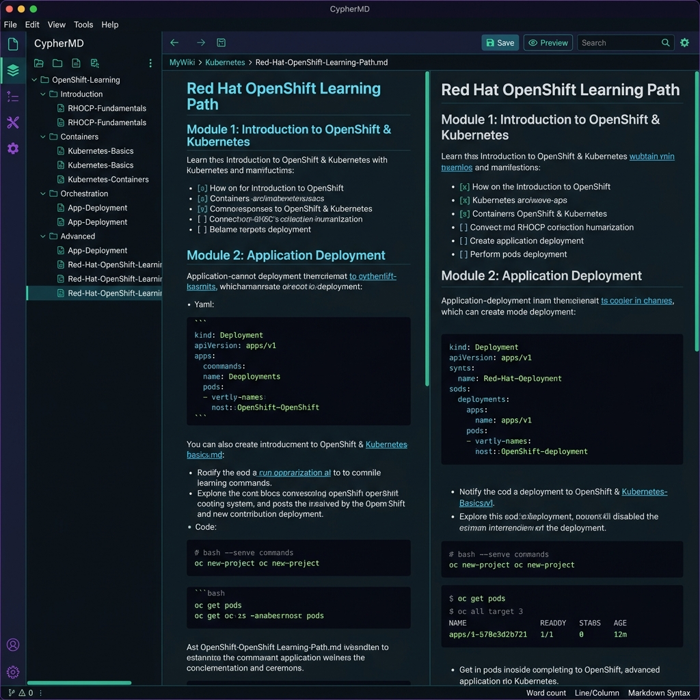
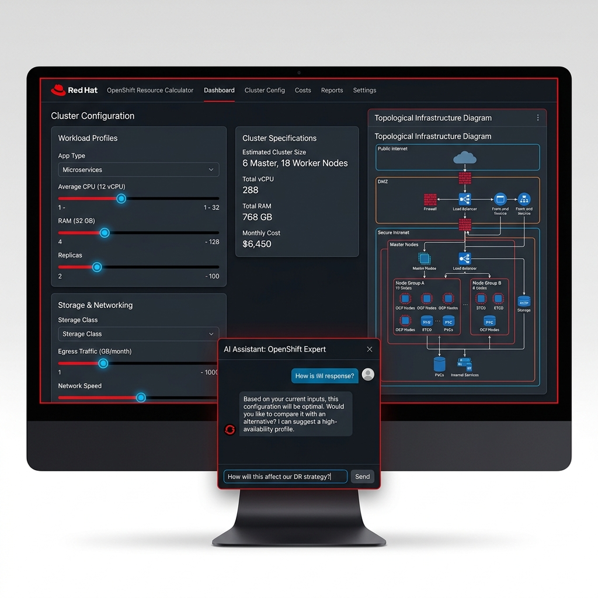

# Awesome Red Hat [](https://awesome.re)

> A curated knowledge base, offline learning academy, and skill-progression vault for **Red Hat Enterprise Linux, Ansible, and the OpenShift ecosystem**.
> Designed for wiki-style reading in [Obsidian](https://obsidian.md/), and fully browsable on GitHub.

<p align="center">
  <b>150+ Technical Notes</b> · <b>12 Knowledge Areas</b> · <b>5 Local Skill Paths</b> · <b>8 Certification Guides with Mock Labs</b>
</p>

---

## 🚀 The Local Offline Academy (Enriched in v2.1.0!)

This repository is a **fully-fledged, self-contained offline learning platform**. You no longer need external resources to study core concepts. All curriculum notes, CLI walkthroughs, configuration templates, architectural design records, and practice exams reside directly inside this vault. In **v2.1.0**, all OpenShift courses (DO180, DO280, DO380, DO188, DO288, DO378) have been fully enriched with in-depth architectures, copy-pasteable YAML manifests, troubleshooting cheat-sheets, and step-by-step local practice labs.



### Option 1: Open in Obsidian (Recommended)
Obsidian connects these markdown files into a browsable local wiki with dynamic graph views, backlinks, and instant search indexers.
```bash
# 1. Clone the repository
git clone https://github.com/winnerineast/awesome-redhat.git

# 2. Open Obsidian -> "Open folder as vault" -> select the awesome-redhat directory
# 3. Start at the Dashboard: [00-Home/Dashboard.md](00-Home/Dashboard.md)
```

### Option 2: Run the OpenShift Sizing Calculator & Discovery Chatbot (Local Tool)
This vault contains an interactive architectural sizing calculator and discovery chatbot powered by a local Ollama model (Qwen).



1. **Prerequisites**:
   - Python 3 installed.
   - [Ollama](https://ollama.com/) installed and running locally.
2. **Start Ollama with CORS origins enabled** (required for the browser to communicate with the model):
   - **Windows (PowerShell)**:
     ```powershell
     $env:OLLAMA_ORIGINS="*" ; ollama serve
     ```
   - **macOS / Linux**:
     ```bash
     OLLAMA_ORIGINS="*" ollama serve
     ```
3. **Download/run the model**:
   ```bash
   ollama run qwen
   ```
4. **Launch the Sizing Web App**:
   - Navigate to the tool directory:
     ```bash
     cd Tools/Resource-Calculator
     ```
   - Start the local HTTP server:
     ```bash
     python -m http.server 8000
     ```
   - Open your browser and go to: `http://localhost:8000`
5. **System Prompt Configuration**: Click the settings gear (`⚙️`) inside the chat panel header to dynamically customize prompt guidelines and question sets.

---

## 🗺️ Learning Paths & Local Course Index

Each path contains structured step-by-step progressions mapping localized course materials directly to certification targets.

### 🐧 1. RHEL System Administration Path
*From foundations to managing enterprise servers and storage.*
- 📖 **Local Course Notes:**
  - [RH066-Fundamentals-of-RHEL](04-RHEL/Courses/RH066-Fundamentals-of-RHEL.md) — Free introductory Linux basics (10 modules)
  - [RH124-System-Administration-I](04-RHEL/Courses/RH124-System-Administration-I.md) — Linux command line, users, standard permissions, and services (13 modules)
  - [RH134-System-Administration-II](04-RHEL/Courses/RH134-System-Administration-II.md) — Advanced storage (LVM/Stratis), firewalld, SELinux, and containers (11 modules)
  - [RH199-RHCSA-Rapid-Track](04-RHEL/Courses/RH199-RHCSA-Rapid-Track.md) — Combined fast-track guide
- 🎯 **Certification Guide:**
  - [EX200-RHCSA](11-Certifications/EX200-RHCSA.md) — **RHCSA Study Guide** (includes a complete 12-task mock lab)

### 🏗️ 2. OpenShift Administrator Path
*From first-time cluster user to advanced platform engineer.*
- 📖 **Local Course Notes:**
  - [DO180-OpenShift-Administration-I](02-OpenShift/Courses/DO180-OpenShift-Administration-I.md) — Core concepts, deployments, logs, probes, and resource requests (8 modules)
  - [DO280-OpenShift-Administration-II](02-OpenShift/Courses/DO280-OpenShift-Administration-II.md) — Authentication, RBAC, ingress routing, NetworkPolicies, and scheduling (7 modules)
  - [DO380-OpenShift-Administration-III](02-OpenShift/Courses/DO380-OpenShift-Administration-III.md) — Operators, GitOps (Argo CD), metrics scraping, logging, and ACM (7 modules)
- 🎯 **Certification Guides:**
  - [EX180-Containers-Kubernetes](11-Certifications/EX180-Containers-Kubernetes.md) — **Specialist Exam Guide** (includes a 5-task local Podman lab)
  - [EX280-OpenShift-Admin](11-Certifications/EX280-OpenShift-Admin.md) — **OCP Administrator Guide** (includes a 6-task mock exam)
  - [EX380-OpenShift-Advanced](11-Certifications/EX380-OpenShift-Advanced.md) — **Advanced Administrator Guide** (includes a 5-task mock exam)

### 💻 3. OpenShift Developer Path
*Building, containerizing, and packaging microservices.*
- 📖 **Local Course Notes:**
  - [DO080-Containerized-Applications-Overview](02-OpenShift/Courses/DO080-Containerized-Applications-Overview.md) — Free containerization overview (2 modules)
  - [DO188-OpenShift-Development-I](02-OpenShift/Courses/DO188-OpenShift-Development-I.md) — Image builds, Podman local networks, and local Pods (4 modules)
  - [DO288-OpenShift-Development-II](02-OpenShift/Courses/DO288-OpenShift-Development-II.md) — S2I custom builder images, Helm, and Tekton pipelines (4 modules)
  - [DO378-Cloud-Native-Microservices](02-OpenShift/Courses/DO378-Cloud-Native-Microservices.md) — Quarkus, reactive Mutiny, serverless Knative, and Kafka (4 modules)
- 🎯 **Certification Guide:**
  - [EX288-OpenShift-Developer](11-Certifications/EX288-OpenShift-Developer.md) — **OCP Application Developer Guide** (includes a 4-task mock exam)

### ⚙️ 4. Ansible Automation Path
*Automating server configurations, networking, and application deployments.*
- 📖 **Local Course Notes:**
  - [RH294-Ansible-Automation](05-Ansible/Courses/RH294-Ansible-Automation.md) — Configurations, playbooks, variables, loops, templates, roles, and vault (4 modules)
  - [DO447-Advanced-Ansible](05-Ansible/Courses/DO447-Advanced-Ansible.md) — Advanced variable scopes, task delegations, serial rolling updates, and AAP (4 modules)
  - [DO457-Network-Automation](05-Ansible/Courses/DO457-Network-Automation.md) — Network CLI connection plugins, Cisco/Juniper integrations, and auto-backups (3 modules)
- 🎯 **Certification Guides:**
  - [EX294-Ansible](11-Certifications/EX294-Ansible.md) — **RHCE Exam Guide** (includes a 6-task mock exam)
  - [EX447-Advanced-Ansible](11-Certifications/EX447-Advanced-Ansible.md) — **Advanced Specialist Guide** (includes a 3-task mock exam)

### 🏛️ 5. OpenShift Architect Path
*Designing hybrid cloud platforms, fleet management, and security controls.*
- 📖 **Local Architecture Guide:**
  - [Architect-Path-Overview](02-OpenShift/Courses/Architect-Path-Overview.md) — Node topologies, ROSA/ARO designs, zero-trust ACS, Service Mesh, and ODF
- 🎯 **Certification Guide:**
  - [RHCA](11-Certifications/RHCA.md) — **Red Hat Certified Architect Roadmap** (covers requirements and 5 recommended exams)

---

## 📦 Directory Map & Knowledge Areas

| Folder | Domain | Focus Area | Note Count |
|:-------|:-------|:-----------|-----------:|
| [`00-Home/`](00-Home/) | Home base | Dashboards, terminology glossaries, vault guidelines | 3 |
| [`01-Learning-Paths/`](01-Learning-Paths/) | Skill Paths | MOC pathways linking localized course notes | 6 |
| [`02-OpenShift/`](02-OpenShift/) | OpenShift Core | Architecture, ingress routes, Storage Classes, SCCs, CI/CD | 44 |
| [`03-Kubernetes-Fundamentals/`](03-Kubernetes-Fundamentals/) | Upstream K8s | Pod lifecycles, ConfigMaps, Helm charts, and custom CRDs | 9 |
| [`04-RHEL/`](04-RHEL/) | RHEL Linux | System administration, package managers, SELinux, and systemd | 10 |
| [`05-Ansible/`](05-Ansible/) | Ansible platform | AAP Automation Controller, Collections, and EEs | 7 |
| [`06-Cloud-Services/`](06-Cloud-Services/) | Managed Clouds | Managed offerings (ROSA, ARO, OSD) and Hybrid design | 6 |
| [`07-DevSecOps/`](07-DevSecOps/) | Security Operations | Vulnerability scan engines (ACS), compliance auditing, image signing | 6 |
| [`08-Middleware-and-Runtimes/`](08-Middleware-and-Runtimes/) | Application Runtimes | Quarkus native builds, Spring Boot on UBI, Knative Serverless | 6 |
| [`09-Data-and-Integration/`](09-Data-and-Integration/) | Data Pipelines | AMQ Streams (Kafka), Camel K route integrations, 3scale API | 5 |
| [`10-AI-ML-on-OpenShift/`](10-AI-ML-on-OpenShift/) | AI/ML workloads | OpenShift AI (RHOAI), GPU operators, and model serving | 5 |
| [`11-Certifications/`](11-Certifications/) | Certifications | Exam blueprints, practical study tips, and mock labs | 9 |
| [`12-Awesome-Resources/`](12-Awesome-Resources/) | References | Curated community forums, news, free books, and sandbox labs | 9 |

---

## 🤝 Contributing & License

This is a shared technical reference. If you want to contribute:
1. **Fork** this repository.
2. Create new notes using templates from the [`Templates/`](Templates/) directory.
3. Use relative markdown links to maintain target node mappings and compatibility across GitHub and Obsidian.
4. Open a **Pull Request**.

This project is licensed under the MIT License — see the [LICENSE](LICENSE) file for details.
